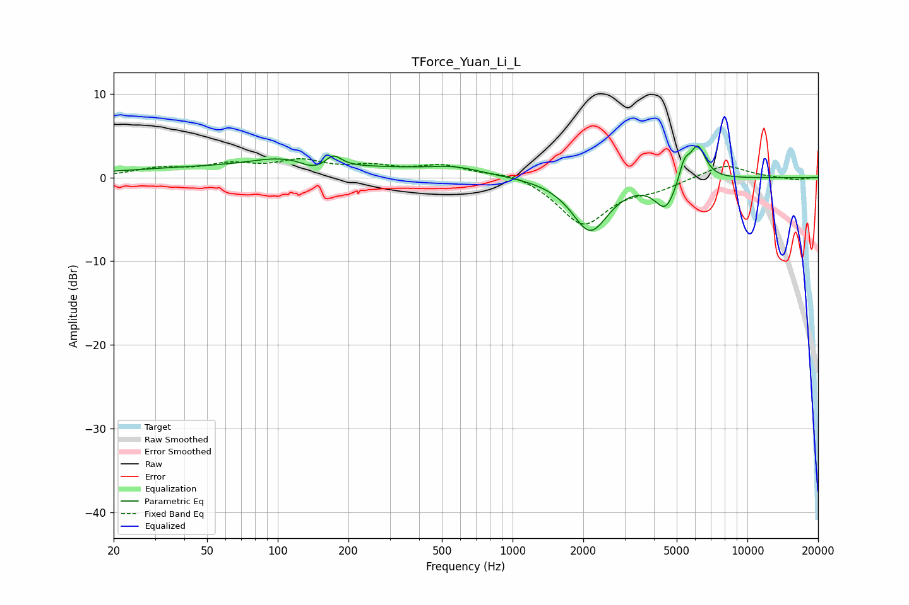

# TForce_Yuan_Li_L
See [usage instructions](https://github.com/jaakkopasanen/AutoEq#usage) for more options and info.

### Parametric EQs
Apply preamp of -3.9 dB when using parametric equalizer.

|   # | Type    |   Fc (Hz) |    Q |   Gain (dB) |
|-----|---------|-----------|------|-------------|
|   1 | Peaking |       104 | 0.18 |         1.4 |
|   2 | Peaking |       106 | 2.29 |        -0.5 |
|   3 | Peaking |       112 | 1.34 |         2.2 |
|   4 | Peaking |       140 | 1.72 |        -1.7 |
|   5 | Peaking |       173 | 4.17 |         1.5 |
|   6 | Peaking |       569 | 1.32 |         0.7 |
|   7 | Peaking |      2140 | 1.81 |        -6.4 |
|   8 | Peaking |      4487 | 3.11 |        -3.5 |
|   9 | Peaking |      5384 | 5.99 |         2.3 |
|  10 | Peaking |      6143 | 4.06 |         4.1 |

### Fixed Band EQs
When using fixed band (also called graphic) equalizer, apply preamp of **-2.3 dB** (if available) and set gains manually with these parameters.

|   # | Type    |   Fc (Hz) |    Q |   Gain (dB) |
|-----|---------|-----------|------|-------------|
|   1 | Peaking |        31 | 1.41 |         1   |
|   2 | Peaking |        62 | 1.41 |         1.3 |
|   3 | Peaking |       125 | 1.41 |         1.7 |
|   4 | Peaking |       250 | 1.41 |         1.1 |
|   5 | Peaking |       500 | 1.41 |         1.3 |
|   6 | Peaking |      1000 | 1.41 |         0.8 |
|   7 | Peaking |      2000 | 1.41 |        -5.6 |
|   8 | Peaking |      4000 | 1.41 |        -1.1 |
|   9 | Peaking |      8000 | 1.41 |         1.6 |
|  10 | Peaking |     16000 | 1.41 |        -0.3 |

### Graphs

