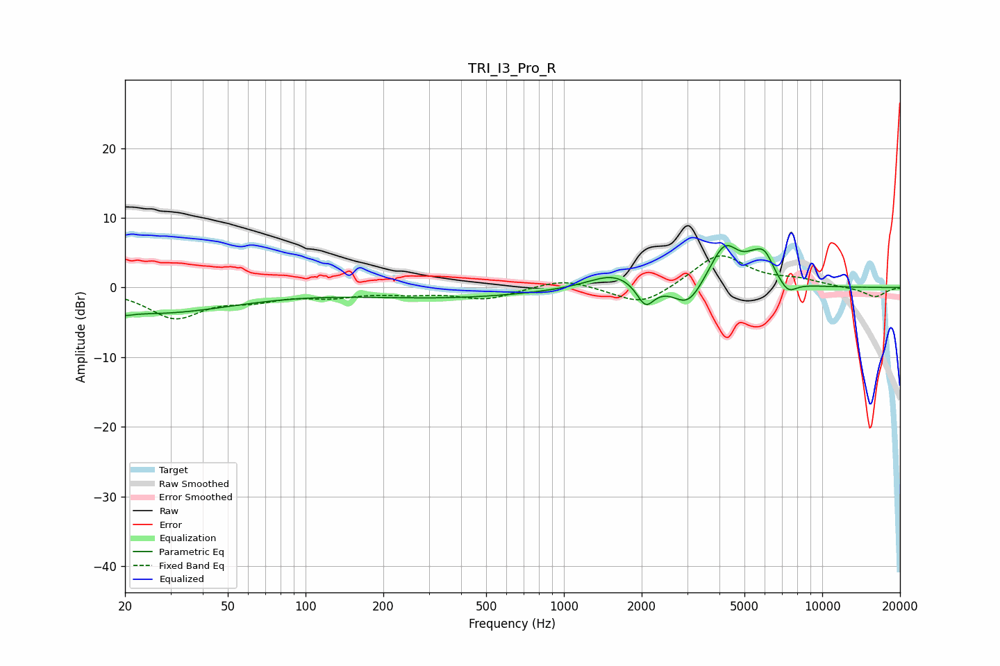

# TRI_I3_Pro_R
See [usage instructions](https://github.com/jaakkopasanen/AutoEq#usage) for more options and info.

### Parametric EQs
Apply preamp of -6.1 dB when using parametric equalizer.

|   # | Type    |   Fc (Hz) |    Q |   Gain (dB) |
|-----|---------|-----------|------|-------------|
|   1 | Peaking |        20 | 5.02 |        -0.5 |
|   2 | Peaking |        25 | 0.43 |        -3.6 |
|   3 | Peaking |       349 | 0.4  |        -1.4 |
|   4 | Peaking |      1568 | 1.43 |         2.3 |
|   5 | Peaking |      2069 | 4.16 |        -3.3 |
|   6 | Peaking |      3027 | 2.46 |        -3.6 |
|   7 | Peaking |      4190 | 2.34 |         6.1 |
|   8 | Peaking |      5397 | 3.42 |         1.7 |
|   9 | Peaking |      5990 | 3.81 |         3.3 |
|  10 | Peaking |      7364 | 4.07 |        -1.7 |

### Fixed Band EQs
When using fixed band (also called graphic) equalizer, apply preamp of **-4.6 dB** (if available) and set gains manually with these parameters.

|   # | Type    |   Fc (Hz) |    Q |   Gain (dB) |
|-----|---------|-----------|------|-------------|
|   1 | Peaking |        31 | 1.41 |        -4.2 |
|   2 | Peaking |        62 | 1.41 |        -1.4 |
|   3 | Peaking |       125 | 1.41 |        -1.1 |
|   4 | Peaking |       250 | 1.41 |        -0.7 |
|   5 | Peaking |       500 | 1.41 |        -1.6 |
|   6 | Peaking |      1000 | 1.41 |         1.3 |
|   7 | Peaking |      2000 | 1.41 |        -2.8 |
|   8 | Peaking |      4000 | 1.41 |         4.9 |
|   9 | Peaking |      8000 | 1.41 |         0.9 |
|  10 | Peaking |     16000 | 1.41 |        -1.4 |

### Graphs

