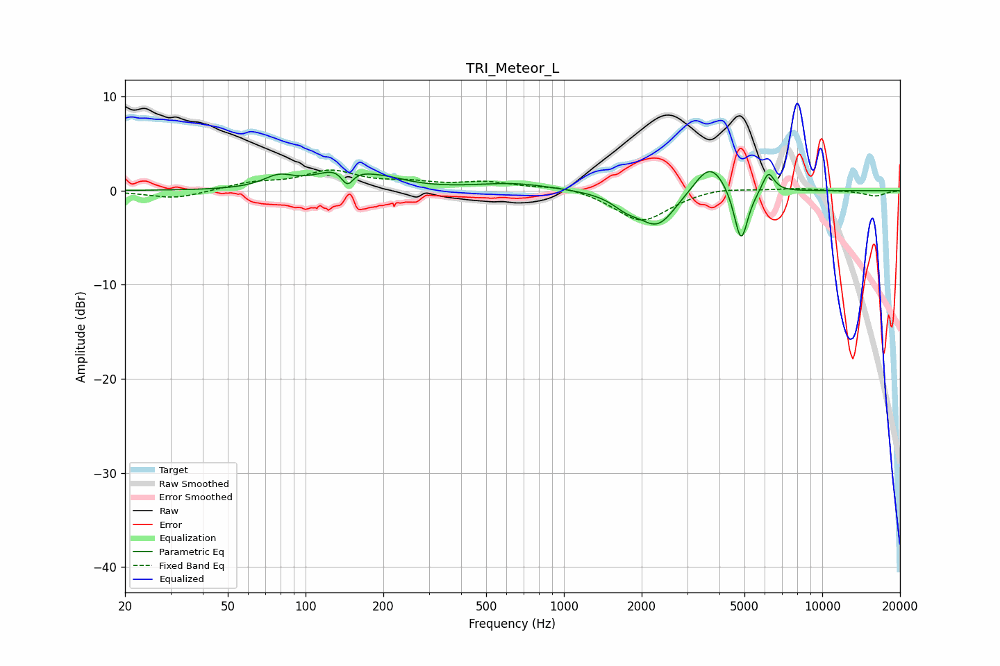

# TRI_Meteor_L
See [usage instructions](https://github.com/jaakkopasanen/AutoEq#usage) for more options and info.

### Parametric EQs
Apply preamp of -2.1 dB when using parametric equalizer.

|   # | Type    |   Fc (Hz) |    Q |   Gain (dB) |
|-----|---------|-----------|------|-------------|
|   1 | Peaking |        79 | 2.42 |         1.2 |
|   2 | Peaking |       137 | 1.58 |         2.1 |
|   3 | Peaking |       145 | 6    |        -1.8 |
|   4 | Peaking |       203 | 1.51 |         0.8 |
|   5 | Peaking |       640 | 0.95 |         0.8 |
|   6 | Peaking |      1747 | 2.6  |        -1.1 |
|   7 | Peaking |      2312 | 1.94 |        -3.7 |
|   8 | Peaking |      3686 | 2.23 |         3.4 |
|   9 | Peaking |      4849 | 5.16 |        -6   |
|  10 | Peaking |      6189 | 6    |         2.2 |

### Fixed Band EQs
When using fixed band (also called graphic) equalizer, apply preamp of **-2.3 dB** (if available) and set gains manually with these parameters.

|   # | Type    |   Fc (Hz) |    Q |   Gain (dB) |
|-----|---------|-----------|------|-------------|
|   1 | Peaking |        31 | 1.41 |        -0.9 |
|   2 | Peaking |        62 | 1.41 |         0.7 |
|   3 | Peaking |       125 | 1.41 |         1.9 |
|   4 | Peaking |       250 | 1.41 |         0.7 |
|   5 | Peaking |       500 | 1.41 |         0.8 |
|   6 | Peaking |      1000 | 1.41 |         0.6 |
|   7 | Peaking |      2000 | 1.41 |        -3.3 |
|   8 | Peaking |      4000 | 1.41 |         0.4 |
|   9 | Peaking |      8000 | 1.41 |         0.3 |
|  10 | Peaking |     16000 | 1.41 |        -0.6 |

### Graphs

