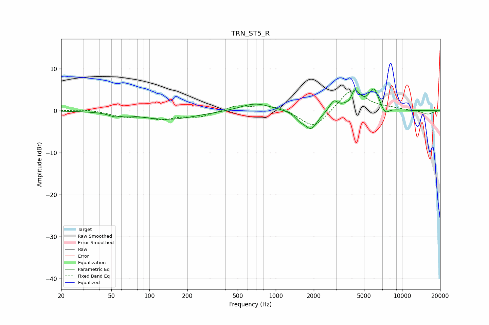

# TRN_ST5_R
See [usage instructions](https://github.com/jaakkopasanen/AutoEq#usage) for more options and info.

### Parametric EQs
Apply preamp of -5.3 dB when using parametric equalizer.

|   # | Type    |   Fc (Hz) |    Q |   Gain (dB) |
|-----|---------|-----------|------|-------------|
|   1 | Peaking |        53 | 3.12 |        -0.8 |
|   2 | Peaking |       140 | 0.63 |        -2.1 |
|   3 | Peaking |       692 | 1.18 |         1.9 |
|   4 | Peaking |      1551 | 3.78 |        -1.2 |
|   5 | Peaking |      1906 | 2.64 |        -4.4 |
|   6 | Peaking |      2873 | 4.39 |         2.3 |
|   7 | Peaking |      3920 | 4.86 |        -2.1 |
|   8 | Peaking |      4160 | 3.34 |         5.8 |
|   9 | Peaking |      5982 | 3.46 |         4.9 |
|  10 | Peaking |      7336 | 4.4  |        -1.7 |

### Fixed Band EQs
When using fixed band (also called graphic) equalizer, apply preamp of **-4.8 dB** (if available) and set gains manually with these parameters.

|   # | Type    |   Fc (Hz) |    Q |   Gain (dB) |
|-----|---------|-----------|------|-------------|
|   1 | Peaking |        31 | 1.41 |         0.4 |
|   2 | Peaking |        62 | 1.41 |        -1.3 |
|   3 | Peaking |       125 | 1.41 |        -1.7 |
|   4 | Peaking |       250 | 1.41 |        -1.4 |
|   5 | Peaking |       500 | 1.41 |         1.4 |
|   6 | Peaking |      1000 | 1.41 |         1.2 |
|   7 | Peaking |      2000 | 1.41 |        -4.5 |
|   8 | Peaking |      4000 | 1.41 |         5.4 |
|   9 | Peaking |      8000 | 1.41 |         0.4 |
|  10 | Peaking |     16000 | 1.41 |        -0.8 |

### Graphs

