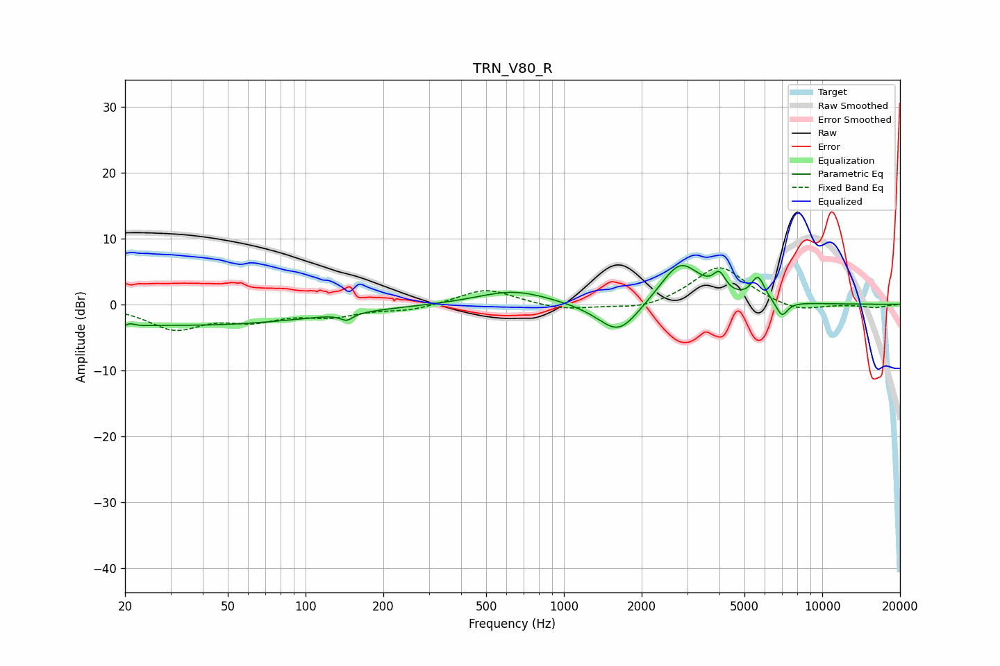

# TRN_V80_R
See [usage instructions](https://github.com/jaakkopasanen/AutoEq#usage) for more options and info.

### Parametric EQs
Apply preamp of -6.0 dB when using parametric equalizer.

|   # | Type    |   Fc (Hz) |    Q |   Gain (dB) |
|-----|---------|-----------|------|-------------|
|   1 | Peaking |        20 | 3.73 |        -2.9 |
|   2 | Peaking |        20 | 5.05 |         2.5 |
|   3 | Peaking |        37 | 0.28 |        -3.1 |
|   4 | Peaking |       144 | 5.9  |        -1   |
|   5 | Peaking |       640 | 1.01 |         2.2 |
|   6 | Peaking |      1629 | 1.74 |        -5.1 |
|   7 | Peaking |      2823 | 1.76 |         6.6 |
|   8 | Peaking |      3999 | 6    |         2.7 |
|   9 | Peaking |      5644 | 5.32 |         3.6 |
|  10 | Peaking |      6980 | 6    |        -2.4 |

### Fixed Band EQs
When using fixed band (also called graphic) equalizer, apply preamp of **-5.6 dB** (if available) and set gains manually with these parameters.

|   # | Type    |   Fc (Hz) |    Q |   Gain (dB) |
|-----|---------|-----------|------|-------------|
|   1 | Peaking |        31 | 1.41 |        -3.5 |
|   2 | Peaking |        62 | 1.41 |        -2   |
|   3 | Peaking |       125 | 1.41 |        -1.6 |
|   4 | Peaking |       250 | 1.41 |        -0.8 |
|   5 | Peaking |       500 | 1.41 |         2.5 |
|   6 | Peaking |      1000 | 1.41 |        -0.9 |
|   7 | Peaking |      2000 | 1.41 |        -1   |
|   8 | Peaking |      4000 | 1.41 |         5.9 |
|   9 | Peaking |      8000 | 1.41 |        -1.3 |
|  10 | Peaking |     16000 | 1.41 |        -0.5 |

### Graphs

