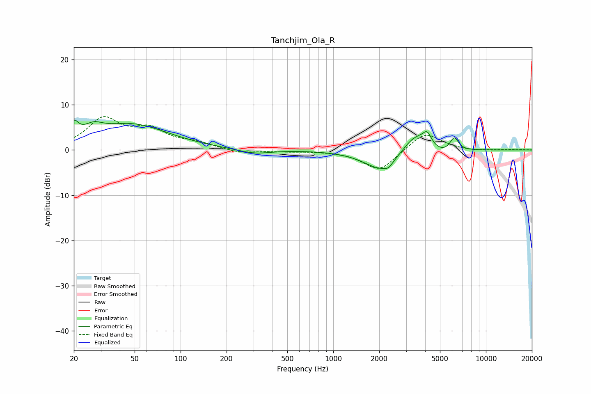

# Tanchjim_Ola_R
See [usage instructions](https://github.com/jaakkopasanen/AutoEq#usage) for more options and info.

### Parametric EQs
Apply preamp of -6.7 dB when using parametric equalizer.

|   # | Type    |   Fc (Hz) |    Q |   Gain (dB) |
|-----|---------|-----------|------|-------------|
|   1 | Peaking |        20 | 4.89 |         3.4 |
|   2 | Peaking |        27 | 2.26 |         2.2 |
|   3 | Peaking |        48 | 0.58 |         5.6 |
|   4 | Peaking |       303 | 1.35 |        -1   |
|   5 | Peaking |      2089 | 1.22 |        -4.7 |
|   6 | Peaking |      2299 | 5.72 |        -0.9 |
|   7 | Peaking |      3434 | 1.65 |         4.3 |
|   8 | Peaking |      4121 | 4.91 |         2.7 |
|   9 | Peaking |      5101 | 1.64 |        -1.2 |
|  10 | Peaking |      6203 | 4.79 |         3   |

### Fixed Band EQs
When using fixed band (also called graphic) equalizer, apply preamp of **-7.5 dB** (if available) and set gains manually with these parameters.

|   # | Type    |   Fc (Hz) |    Q |   Gain (dB) |
|-----|---------|-----------|------|-------------|
|   1 | Peaking |        31 | 1.41 |         6.6 |
|   2 | Peaking |        62 | 1.41 |         4   |
|   3 | Peaking |       125 | 1.41 |         1.4 |
|   4 | Peaking |       250 | 1.41 |        -0.8 |
|   5 | Peaking |       500 | 1.41 |        -0.3 |
|   6 | Peaking |      1000 | 1.41 |        -0.1 |
|   7 | Peaking |      2000 | 1.41 |        -4.7 |
|   8 | Peaking |      4000 | 1.41 |         4.1 |
|   9 | Peaking |      8000 | 1.41 |        -0.3 |
|  10 | Peaking |     16000 | 1.41 |         0.2 |

### Graphs

