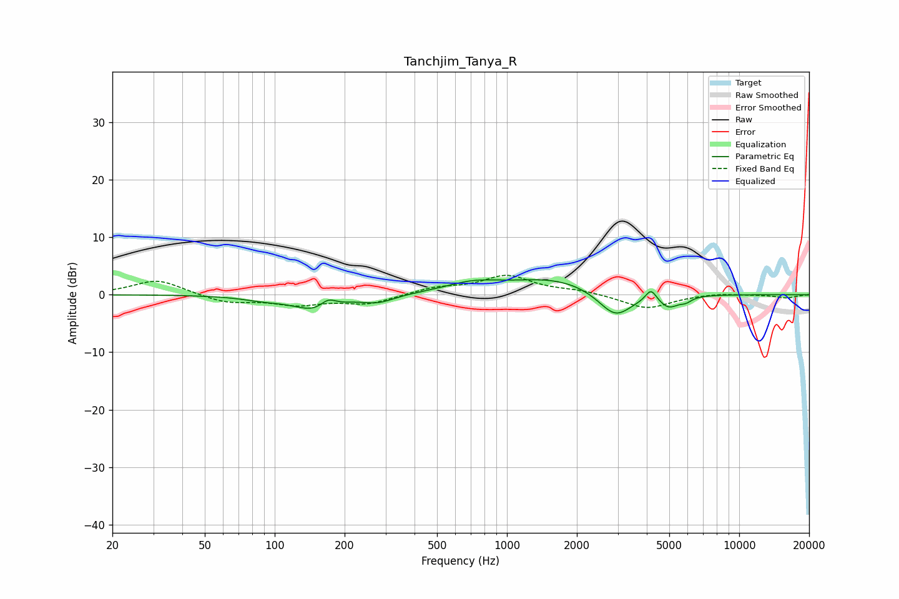

# Tanchjim_Tanya_R
See [usage instructions](https://github.com/jaakkopasanen/AutoEq#usage) for more options and info.

### Parametric EQs
Apply preamp of -2.7 dB when using parametric equalizer.

|   # | Type    |   Fc (Hz) |    Q |   Gain (dB) |
|-----|---------|-----------|------|-------------|
|   1 | Peaking |        90 | 1.48 |        -0.7 |
|   2 | Peaking |       152 | 1.55 |        -2.7 |
|   3 | Peaking |       170 | 4.08 |         1.7 |
|   4 | Peaking |       280 | 2.11 |        -1.2 |
|   5 | Peaking |       709 | 1.21 |         1.6 |
|   6 | Peaking |      1614 | 0.7  |         2.8 |
|   7 | Peaking |      2926 | 1.91 |        -4.7 |
|   8 | Peaking |      4172 | 6    |         2.1 |
|   9 | Peaking |      4975 | 3.21 |        -2.1 |
|  10 | Peaking |      5898 | 5.58 |        -0.7 |

### Fixed Band EQs
When using fixed band (also called graphic) equalizer, apply preamp of **-3.5 dB** (if available) and set gains manually with these parameters.

|   # | Type    |   Fc (Hz) |    Q |   Gain (dB) |
|-----|---------|-----------|------|-------------|
|   1 | Peaking |        31 | 1.41 |         2.6 |
|   2 | Peaking |        62 | 1.41 |        -1.4 |
|   3 | Peaking |       125 | 1.41 |        -1.6 |
|   4 | Peaking |       250 | 1.41 |        -1.6 |
|   5 | Peaking |       500 | 1.41 |         1.1 |
|   6 | Peaking |      1000 | 1.41 |         3.2 |
|   7 | Peaking |      2000 | 1.41 |         0.6 |
|   8 | Peaking |      4000 | 1.41 |        -2.5 |
|   9 | Peaking |      8000 | 1.41 |         0.3 |
|  10 | Peaking |     16000 | 1.41 |        -0.6 |

### Graphs

