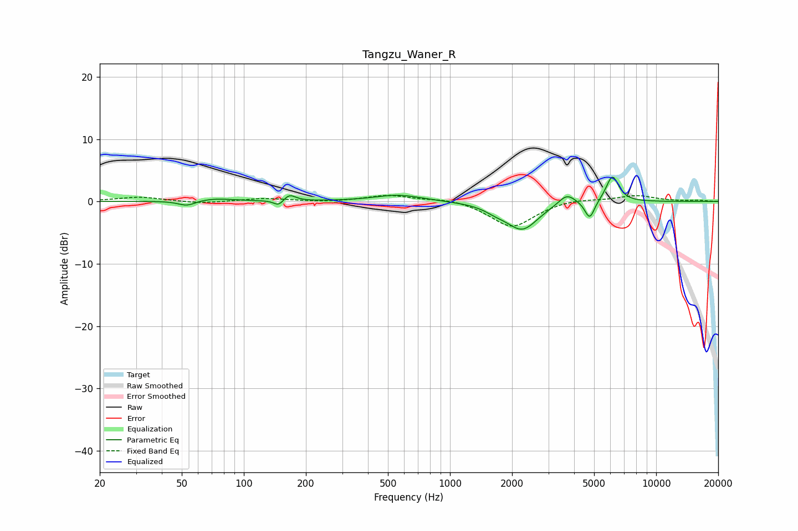

# Tangzu_Waner_R
See [usage instructions](https://github.com/jaakkopasanen/AutoEq#usage) for more options and info.

### Parametric EQs
Apply preamp of -4.0 dB when using parametric equalizer.

|   # | Type    |   Fc (Hz) |    Q |   Gain (dB) |
|-----|---------|-----------|------|-------------|
|   1 | Peaking |        53 | 3.4  |        -0.8 |
|   2 | Peaking |        71 | 1.48 |         0.5 |
|   3 | Peaking |       148 | 6    |        -1   |
|   4 | Peaking |       166 | 4.86 |         1.1 |
|   5 | Peaking |       562 | 1.21 |         1.1 |
|   6 | Peaking |      1665 | 2.63 |        -0.7 |
|   7 | Peaking |      2241 | 1.84 |        -4.4 |
|   8 | Peaking |      3688 | 3.41 |         1.8 |
|   9 | Peaking |      4761 | 6    |        -3   |
|  10 | Peaking |      6136 | 4.48 |         4.2 |

### Fixed Band EQs
When using fixed band (also called graphic) equalizer, apply preamp of **-1.1 dB** (if available) and set gains manually with these parameters.

|   # | Type    |   Fc (Hz) |    Q |   Gain (dB) |
|-----|---------|-----------|------|-------------|
|   1 | Peaking |        31 | 1.41 |         0.7 |
|   2 | Peaking |        62 | 1.41 |        -0.4 |
|   3 | Peaking |       125 | 1.41 |         0.5 |
|   4 | Peaking |       250 | 1.41 |        -0.1 |
|   5 | Peaking |       500 | 1.41 |         1   |
|   6 | Peaking |      1000 | 1.41 |         0.6 |
|   7 | Peaking |      2000 | 1.41 |        -4.2 |
|   8 | Peaking |      4000 | 1.41 |         0.5 |
|   9 | Peaking |      8000 | 1.41 |         1   |
|  10 | Peaking |     16000 | 1.41 |         0.2 |

### Graphs

