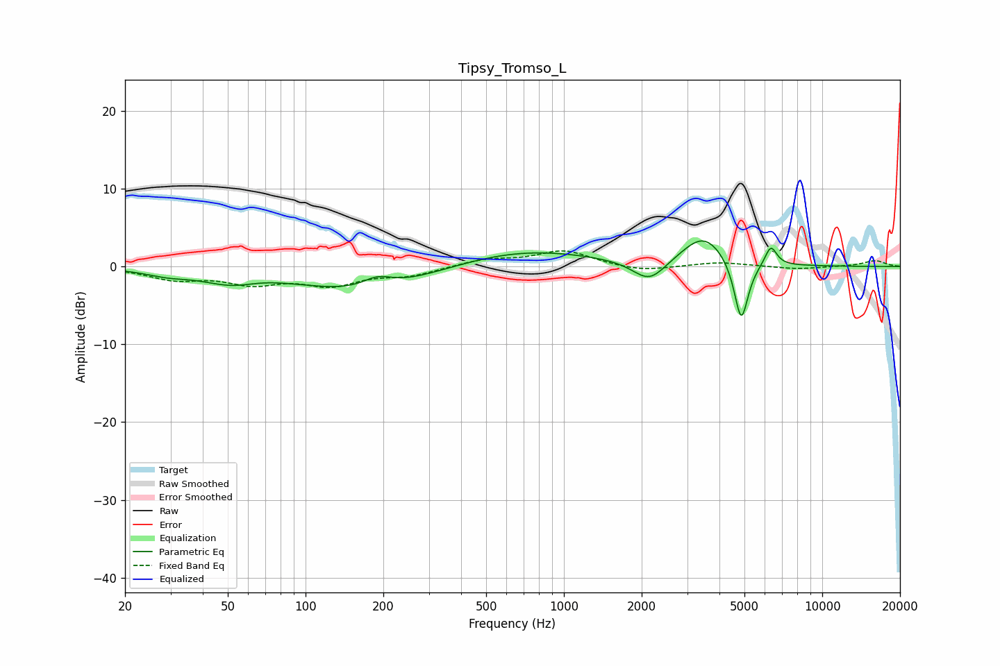

# Tipsy_Tromso_L
See [usage instructions](https://github.com/jaakkopasanen/AutoEq#usage) for more options and info.

### Parametric EQs
Apply preamp of -3.4 dB when using parametric equalizer.

|   # | Type    |   Fc (Hz) |    Q |   Gain (dB) |
|-----|---------|-----------|------|-------------|
|   1 | Peaking |        29 | 1.64 |        -0.7 |
|   2 | Peaking |        52 | 1.24 |        -1.7 |
|   3 | Peaking |        67 | 1.55 |         0.4 |
|   4 | Peaking |       171 | 0.55 |        -3.3 |
|   5 | Peaking |       190 | 2.4  |         1.4 |
|   6 | Peaking |       676 | 0.5  |         2.3 |
|   7 | Peaking |      2143 | 2.18 |        -2.9 |
|   8 | Peaking |      3477 | 1.64 |         4.1 |
|   9 | Peaking |      4857 | 5.07 |        -8.2 |
|  10 | Peaking |      6324 | 6    |         2.6 |

### Fixed Band EQs
When using fixed band (also called graphic) equalizer, apply preamp of **-2.1 dB** (if available) and set gains manually with these parameters.

|   # | Type    |   Fc (Hz) |    Q |   Gain (dB) |
|-----|---------|-----------|------|-------------|
|   1 | Peaking |        31 | 1.41 |        -1.5 |
|   2 | Peaking |        62 | 1.41 |        -1.9 |
|   3 | Peaking |       125 | 1.41 |        -2.2 |
|   4 | Peaking |       250 | 1.41 |        -1   |
|   5 | Peaking |       500 | 1.41 |         0.9 |
|   6 | Peaking |      1000 | 1.41 |         2   |
|   7 | Peaking |      2000 | 1.41 |        -0.7 |
|   8 | Peaking |      4000 | 1.41 |         0.6 |
|   9 | Peaking |      8000 | 1.41 |        -0.4 |
|  10 | Peaking |     16000 | 1.41 |         0.8 |

### Graphs

