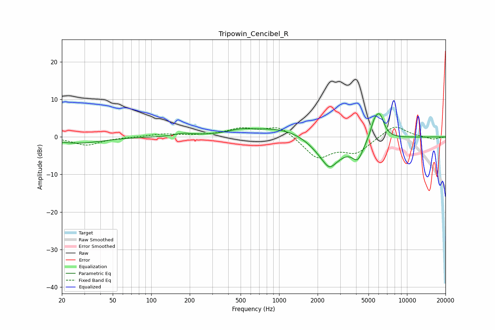

# Tripowin_Cencibel_R
See [usage instructions](https://github.com/jaakkopasanen/AutoEq#usage) for more options and info.

### Parametric EQs
Apply preamp of -6.3 dB when using parametric equalizer.

|   # | Type    |   Fc (Hz) |    Q |   Gain (dB) |
|-----|---------|-----------|------|-------------|
|   1 | Peaking |        27 | 0.77 |        -1.7 |
|   2 | Peaking |       182 | 2.05 |         0.8 |
|   3 | Peaking |       200 | 3.97 |        -0.1 |
|   4 | Peaking |       491 | 1.55 |         0.9 |
|   5 | Peaking |      1101 | 0.54 |         2.9 |
|   6 | Peaking |      2461 | 1.18 |        -7.6 |
|   7 | Peaking |      2471 | 3.59 |        -1.5 |
|   8 | Peaking |      4124 | 3.12 |        -4.5 |
|   9 | Peaking |      5600 | 3.92 |         4.3 |
|  10 | Peaking |      6173 | 4.05 |         4.7 |

### Fixed Band EQs
When using fixed band (also called graphic) equalizer, apply preamp of **-2.7 dB** (if available) and set gains manually with these parameters.

|   # | Type    |   Fc (Hz) |    Q |   Gain (dB) |
|-----|---------|-----------|------|-------------|
|   1 | Peaking |        31 | 1.41 |        -2.2 |
|   2 | Peaking |        62 | 1.41 |        -0.1 |
|   3 | Peaking |       125 | 1.41 |         0.8 |
|   4 | Peaking |       250 | 1.41 |         0.3 |
|   5 | Peaking |       500 | 1.41 |         2   |
|   6 | Peaking |      1000 | 1.41 |         3   |
|   7 | Peaking |      2000 | 1.41 |        -5.5 |
|   8 | Peaking |      4000 | 1.41 |        -3.9 |
|   9 | Peaking |      8000 | 1.41 |         3.3 |
|  10 | Peaking |     16000 | 1.41 |        -0.7 |

### Graphs

