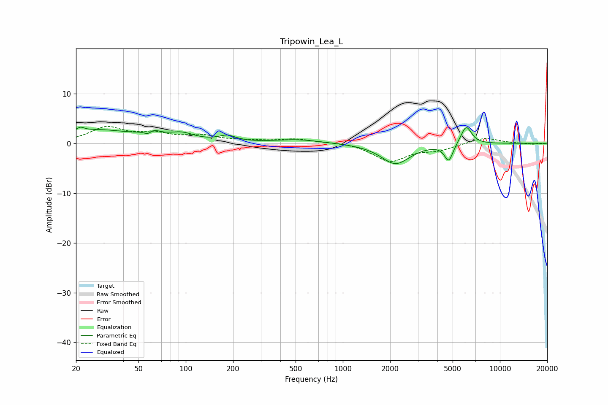

# Tripowin_Lea_L
See [usage instructions](https://github.com/jaakkopasanen/AutoEq#usage) for more options and info.

### Parametric EQs
Apply preamp of -3.3 dB when using parametric equalizer.

|   # | Type    |   Fc (Hz) |    Q |   Gain (dB) |
|-----|---------|-----------|------|-------------|
|   1 | Peaking |        21 | 5.97 |         0.7 |
|   2 | Peaking |        27 | 0.58 |         2.6 |
|   3 | Peaking |        58 | 4.94 |        -1.7 |
|   4 | Peaking |        60 | 3.16 |         2.1 |
|   5 | Peaking |        94 | 1.76 |         1.5 |
|   6 | Peaking |       183 | 2.6  |         1.2 |
|   7 | Peaking |       513 | 0.98 |         0.7 |
|   8 | Peaking |      2165 | 1.54 |        -4.1 |
|   9 | Peaking |      4724 | 5.08 |        -3.5 |
|  10 | Peaking |      6099 | 4    |         3.8 |

### Fixed Band EQs
When using fixed band (also called graphic) equalizer, apply preamp of **-3.5 dB** (if available) and set gains manually with these parameters.

|   # | Type    |   Fc (Hz) |    Q |   Gain (dB) |
|-----|---------|-----------|------|-------------|
|   1 | Peaking |        31 | 1.41 |         3   |
|   2 | Peaking |        62 | 1.41 |         1.6 |
|   3 | Peaking |       125 | 1.41 |         1.3 |
|   4 | Peaking |       250 | 1.41 |         0.4 |
|   5 | Peaking |       500 | 1.41 |         0.8 |
|   6 | Peaking |      1000 | 1.41 |         0.3 |
|   7 | Peaking |      2000 | 1.41 |        -3.5 |
|   8 | Peaking |      4000 | 1.41 |        -1.2 |
|   9 | Peaking |      8000 | 1.41 |         1.2 |
|  10 | Peaking |     16000 | 1.41 |        -0.2 |

### Graphs

