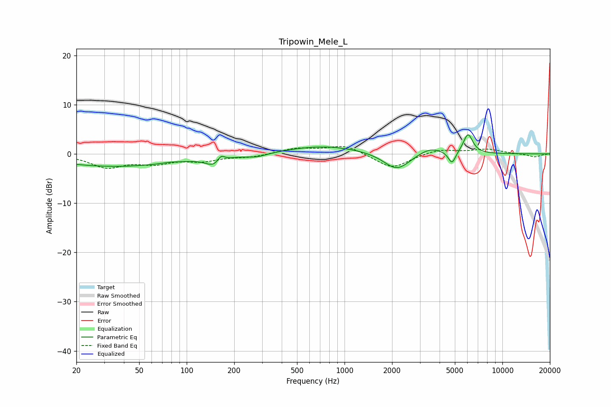

# Tripowin_Mele_L
See [usage instructions](https://github.com/jaakkopasanen/AutoEq#usage) for more options and info.

### Parametric EQs
Apply preamp of -3.9 dB when using parametric equalizer.

|   # | Type    |   Fc (Hz) |    Q |   Gain (dB) |
|-----|---------|-----------|------|-------------|
|   1 | Peaking |        35 | 0.36 |        -2.5 |
|   2 | Peaking |        78 | 3.43 |         0.2 |
|   3 | Peaking |       150 | 2.72 |        -1.8 |
|   4 | Peaking |       165 | 5.97 |         1.5 |
|   5 | Peaking |       278 | 2.02 |        -0.7 |
|   6 | Peaking |       748 | 0.6  |         1.6 |
|   7 | Peaking |      2143 | 1.71 |        -3.6 |
|   8 | Peaking |      3486 | 1.86 |         1.4 |
|   9 | Peaking |      4799 | 6    |        -2.6 |
|  10 | Peaking |      6058 | 4.64 |         4   |

### Fixed Band EQs
When using fixed band (also called graphic) equalizer, apply preamp of **-1.6 dB** (if available) and set gains manually with these parameters.

|   # | Type    |   Fc (Hz) |    Q |   Gain (dB) |
|-----|---------|-----------|------|-------------|
|   1 | Peaking |        31 | 1.41 |        -2.6 |
|   2 | Peaking |        62 | 1.41 |        -1.7 |
|   3 | Peaking |       125 | 1.41 |        -1.2 |
|   4 | Peaking |       250 | 1.41 |        -0.6 |
|   5 | Peaking |       500 | 1.41 |         1.1 |
|   6 | Peaking |      1000 | 1.41 |         1.8 |
|   7 | Peaking |      2000 | 1.41 |        -3   |
|   8 | Peaking |      4000 | 1.41 |         1   |
|   9 | Peaking |      8000 | 1.41 |         0.9 |
|  10 | Peaking |     16000 | 1.41 |        -0.6 |

### Graphs

