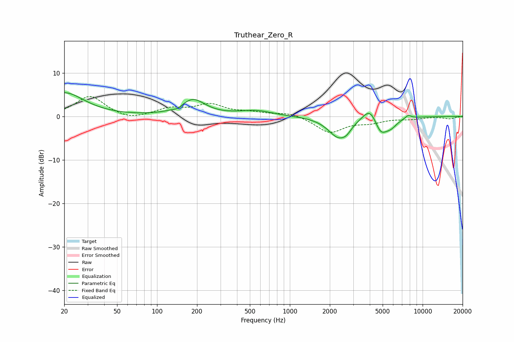

# Truthear_Zero_R
See [usage instructions](https://github.com/jaakkopasanen/AutoEq#usage) for more options and info.

### Parametric EQs
Apply preamp of -5.5 dB when using parametric equalizer.

|   # | Type    |   Fc (Hz) |    Q |   Gain (dB) |
|-----|---------|-----------|------|-------------|
|   1 | Peaking |        20 | 0.95 |         5.4 |
|   2 | Peaking |       143 | 4.83 |        -0.6 |
|   3 | Peaking |       186 | 1.54 |         3.8 |
|   4 | Peaking |       552 | 1.13 |         1.2 |
|   5 | Peaking |      2313 | 1.84 |        -4.6 |
|   6 | Peaking |      2672 | 3.81 |        -1.2 |
|   7 | Peaking |      4035 | 2.58 |         3.4 |
|   8 | Peaking |      4823 | 2.94 |        -3.8 |
|   9 | Peaking |      5768 | 2.85 |        -1.8 |
|  10 | Peaking |      7783 | 5.78 |         0.8 |

### Fixed Band EQs
When using fixed band (also called graphic) equalizer, apply preamp of **-4.7 dB** (if available) and set gains manually with these parameters.

|   # | Type    |   Fc (Hz) |    Q |   Gain (dB) |
|-----|---------|-----------|------|-------------|
|   1 | Peaking |        31 | 1.41 |         4.7 |
|   2 | Peaking |        62 | 1.41 |        -1   |
|   3 | Peaking |       125 | 1.41 |         1.7 |
|   4 | Peaking |       250 | 1.41 |         2.5 |
|   5 | Peaking |       500 | 1.41 |         0.7 |
|   6 | Peaking |      1000 | 1.41 |         0.9 |
|   7 | Peaking |      2000 | 1.41 |        -3.7 |
|   8 | Peaking |      4000 | 1.41 |        -1.2 |
|   9 | Peaking |      8000 | 1.41 |        -0.5 |
|  10 | Peaking |     16000 | 1.41 |        -0.5 |

### Graphs

