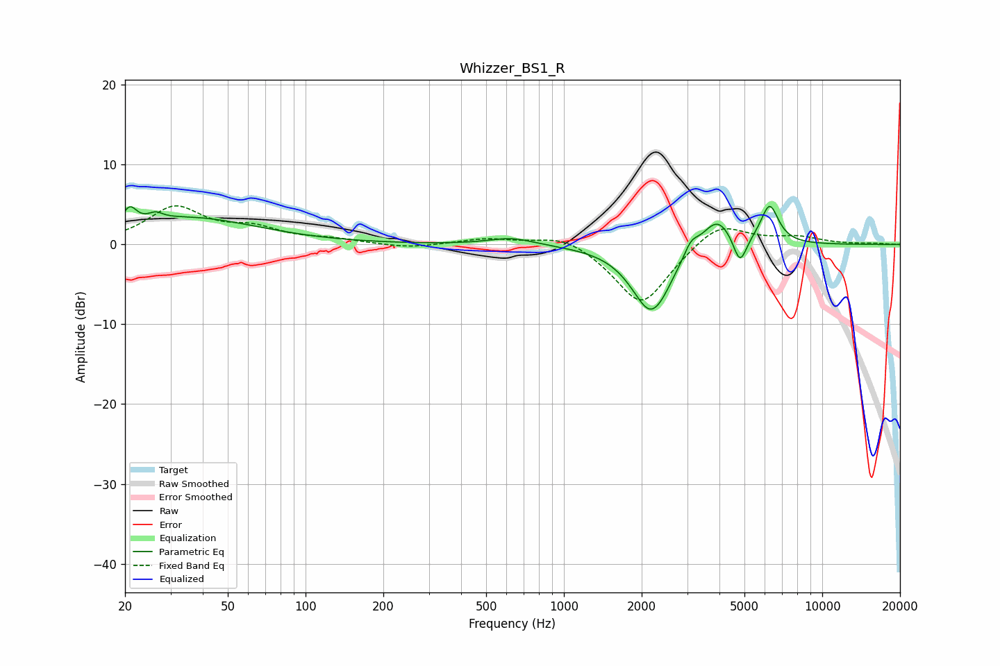

# Whizzer_BS1_R
See [usage instructions](https://github.com/jaakkopasanen/AutoEq#usage) for more options and info.

### Parametric EQs
Apply preamp of -4.9 dB when using parametric equalizer.

|   # | Type    |   Fc (Hz) |    Q |   Gain (dB) |
|-----|---------|-----------|------|-------------|
|   1 | Peaking |        21 | 5.63 |         2.1 |
|   2 | Peaking |        26 | 5.41 |         0.8 |
|   3 | Peaking |        35 | 0.53 |         3.3 |
|   4 | Peaking |       627 | 1.61 |         0.9 |
|   5 | Peaking |      2154 | 1.88 |        -7.9 |
|   6 | Peaking |      2388 | 2.8  |        -1   |
|   7 | Peaking |      3106 | 5.13 |         1.6 |
|   8 | Peaking |      3917 | 2.35 |         3.9 |
|   9 | Peaking |      4802 | 5.37 |        -3.7 |
|  10 | Peaking |      6255 | 3.96 |         4.9 |

### Fixed Band EQs
When using fixed band (also called graphic) equalizer, apply preamp of **-4.9 dB** (if available) and set gains manually with these parameters.

|   # | Type    |   Fc (Hz) |    Q |   Gain (dB) |
|-----|---------|-----------|------|-------------|
|   1 | Peaking |        31 | 1.41 |         4.5 |
|   2 | Peaking |        62 | 1.41 |         1.7 |
|   3 | Peaking |       125 | 1.41 |         0.5 |
|   4 | Peaking |       250 | 1.41 |        -0.5 |
|   5 | Peaking |       500 | 1.41 |         0.8 |
|   6 | Peaking |      1000 | 1.41 |         1.5 |
|   7 | Peaking |      2000 | 1.41 |        -7.8 |
|   8 | Peaking |      4000 | 1.41 |         3.1 |
|   9 | Peaking |      8000 | 1.41 |         0.9 |
|  10 | Peaking |     16000 | 1.41 |         0.1 |

### Graphs

