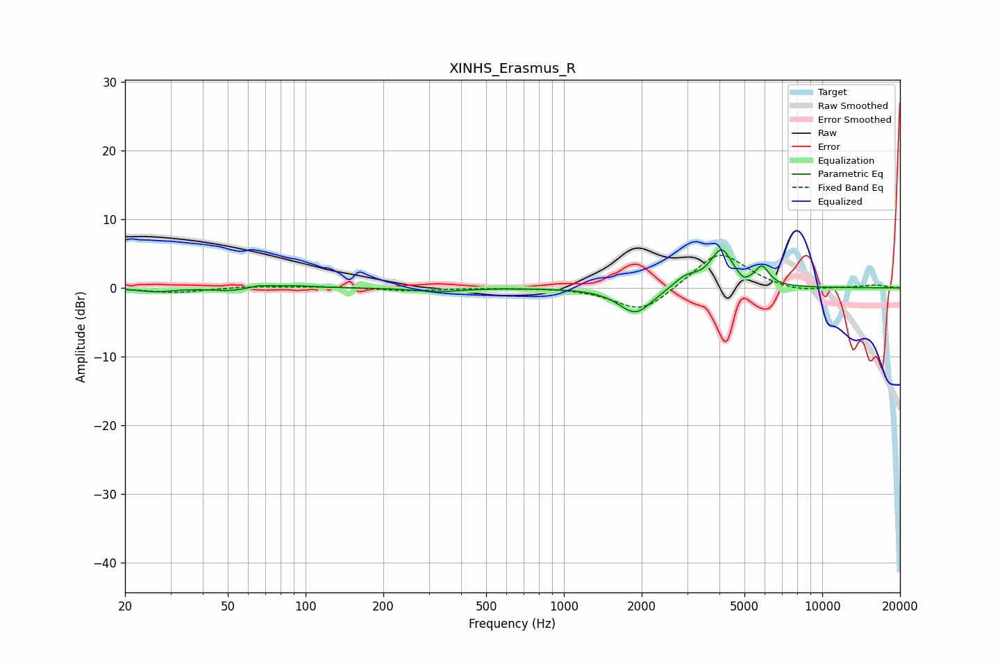

# XINHS_Erasmus_R
See [usage instructions](https://github.com/jaakkopasanen/AutoEq#usage) for more options and info.

### Parametric EQs
Apply preamp of -5.6 dB when using parametric equalizer.

|   # | Type    |   Fc (Hz) |    Q |   Gain (dB) |
|-----|---------|-----------|------|-------------|
|   1 | Peaking |        26 | 2.17 |        -0.5 |
|   2 | Peaking |        52 | 1.99 |        -0.5 |
|   3 | Peaking |        66 | 3.94 |         0.4 |
|   4 | Peaking |        87 | 1.6  |         0.4 |
|   5 | Peaking |       324 | 1.68 |        -0.5 |
|   6 | Peaking |      1893 | 2.19 |        -3.8 |
|   7 | Peaking |      2961 | 3.02 |         1.6 |
|   8 | Peaking |      4075 | 3.21 |         5.4 |
|   9 | Peaking |      4953 | 6    |        -0.9 |
|  10 | Peaking |      5851 | 5.16 |         2.6 |

### Fixed Band EQs
When using fixed band (also called graphic) equalizer, apply preamp of **-4.8 dB** (if available) and set gains manually with these parameters.

|   # | Type    |   Fc (Hz) |    Q |   Gain (dB) |
|-----|---------|-----------|------|-------------|
|   1 | Peaking |        31 | 1.41 |        -0.7 |
|   2 | Peaking |        62 | 1.41 |         0.2 |
|   3 | Peaking |       125 | 1.41 |         0.2 |
|   4 | Peaking |       250 | 1.41 |        -0.4 |
|   5 | Peaking |       500 | 1.41 |         0   |
|   6 | Peaking |      1000 | 1.41 |         0.1 |
|   7 | Peaking |      2000 | 1.41 |        -3.7 |
|   8 | Peaking |      4000 | 1.41 |         5.5 |
|   9 | Peaking |      8000 | 1.41 |        -0.7 |
|  10 | Peaking |     16000 | 1.41 |         0.4 |

### Graphs

