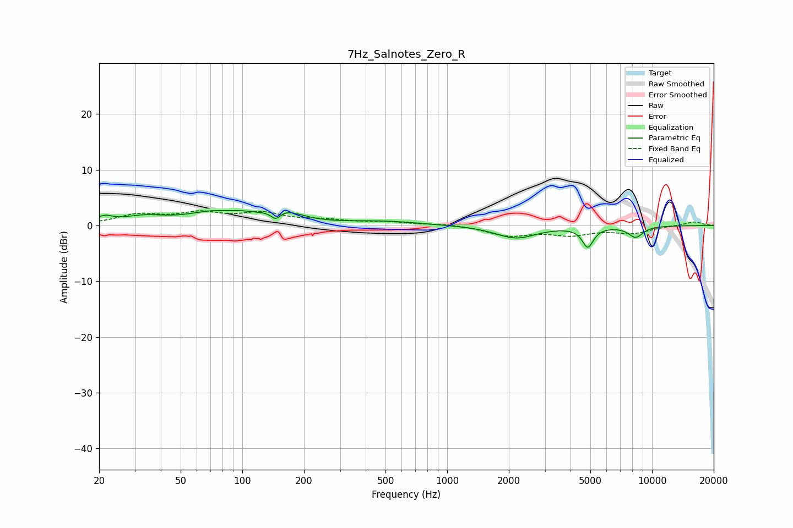

# 7Hz_Salnotes_Zero_R
See [usage instructions](https://github.com/jaakkopasanen/AutoEq#usage) for more options and info.

### Parametric EQs
Apply preamp of -2.8 dB when using parametric equalizer.

|   # | Type    |   Fc (Hz) |    Q |   Gain (dB) |
|-----|---------|-----------|------|-------------|
|   1 | Peaking |        21 | 3.6  |         1.1 |
|   2 | Peaking |        33 | 1.36 |         1.3 |
|   3 | Peaking |        81 | 1.01 |         2.8 |
|   4 | Peaking |        82 | 2.39 |        -0.5 |
|   5 | Peaking |       146 | 6    |        -1.5 |
|   6 | Peaking |       161 | 1.67 |         1.8 |
|   7 | Peaking |       493 | 0.8  |         0.7 |
|   8 | Peaking |      2167 | 1.43 |        -2.2 |
|   9 | Peaking |      4859 | 5.15 |        -3.6 |
|  10 | Peaking |      8320 | 3.6  |        -2   |

### Fixed Band EQs
When using fixed band (also called graphic) equalizer, apply preamp of **-2.7 dB** (if available) and set gains manually with these parameters.

|   # | Type    |   Fc (Hz) |    Q |   Gain (dB) |
|-----|---------|-----------|------|-------------|
|   1 | Peaking |        31 | 1.41 |         1.8 |
|   2 | Peaking |        62 | 1.41 |         1.9 |
|   3 | Peaking |       125 | 1.41 |         1.9 |
|   4 | Peaking |       250 | 1.41 |         0.8 |
|   5 | Peaking |       500 | 1.41 |         0.6 |
|   6 | Peaking |      1000 | 1.41 |         0.3 |
|   7 | Peaking |      2000 | 1.41 |        -1.7 |
|   8 | Peaking |      4000 | 1.41 |        -1.5 |
|   9 | Peaking |      8000 | 1.41 |        -1.3 |
|  10 | Peaking |     16000 | 1.41 |         0.7 |

### Graphs

