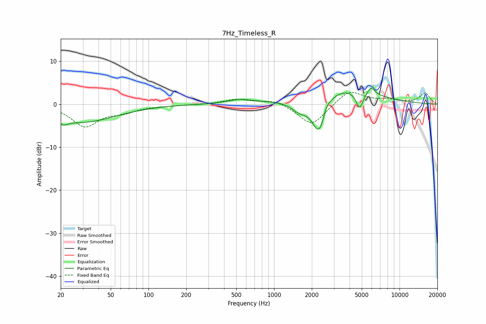

# 7Hz_Timeless_R
See [usage instructions](https://github.com/jaakkopasanen/AutoEq#usage) for more options and info.

### Parametric EQs
Apply preamp of -3.8 dB when using parametric equalizer.

|   # | Type    |   Fc (Hz) |    Q |   Gain (dB) |
|-----|---------|-----------|------|-------------|
|   1 | Peaking |        21 | 4.17 |        -1.1 |
|   2 | Peaking |        29 | 0.52 |        -4.2 |
|   3 | Peaking |       535 | 1.51 |         0.9 |
|   4 | Peaking |      1621 | 1.83 |        -3.1 |
|   5 | Peaking |      2236 | 2.74 |        -6.7 |
|   6 | Peaking |      2419 | 3.4  |        -2.3 |
|   7 | Peaking |      2605 | 5.96 |         1.5 |
|   8 | Peaking |      3215 | 0.52 |         4.2 |
|   9 | Peaking |      4802 | 4.89 |        -4   |
|  10 | Peaking |      5922 | 4.74 |         1.8 |

### Fixed Band EQs
When using fixed band (also called graphic) equalizer, apply preamp of **-2.8 dB** (if available) and set gains manually with these parameters.

|   # | Type    |   Fc (Hz) |    Q |   Gain (dB) |
|-----|---------|-----------|------|-------------|
|   1 | Peaking |        31 | 1.41 |        -5   |
|   2 | Peaking |        62 | 1.41 |        -1.5 |
|   3 | Peaking |       125 | 1.41 |        -0.3 |
|   4 | Peaking |       250 | 1.41 |        -0.1 |
|   5 | Peaking |       500 | 1.41 |         1.1 |
|   6 | Peaking |      1000 | 1.41 |         1.1 |
|   7 | Peaking |      2000 | 1.41 |        -5.1 |
|   8 | Peaking |      4000 | 1.41 |         3.4 |
|   9 | Peaking |      8000 | 1.41 |         0.9 |
|  10 | Peaking |     16000 | 1.41 |         2.5 |

### Graphs

