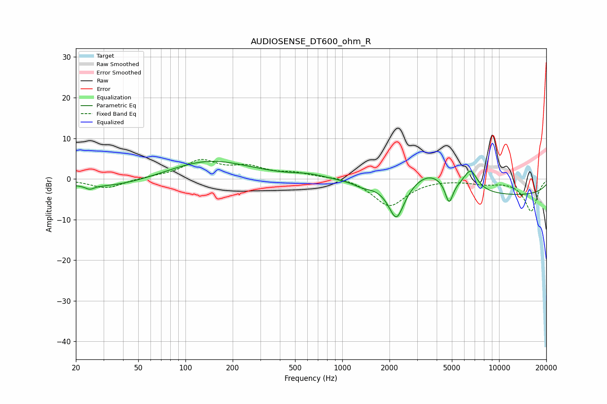

# AUDIOSENSE_DT600_ohm_R
See [usage instructions](https://github.com/jaakkopasanen/AutoEq#usage) for more options and info.

### Parametric EQs
Apply preamp of -4.4 dB when using parametric equalizer.

|   # | Type    |   Fc (Hz) |    Q |   Gain (dB) |
|-----|---------|-----------|------|-------------|
|   1 | Peaking |        25 | 5.56 |        -0.9 |
|   2 | Peaking |        32 | 0.5  |        -2.3 |
|   3 | Peaking |       140 | 0.53 |         4.7 |
|   4 | Peaking |       619 | 1.41 |         0.9 |
|   5 | Peaking |      1348 | 2.61 |        -0.9 |
|   6 | Peaking |      2214 | 2.73 |        -9.2 |
|   7 | Peaking |      3568 | 1.14 |         4.7 |
|   8 | Peaking |      4799 | 5.65 |        -5.5 |
|   9 | Peaking |      6571 | 3.04 |         5   |
|  10 | Peaking |     10000 | 0.18 |        -4.1 |

### Fixed Band EQs
When using fixed band (also called graphic) equalizer, apply preamp of **-4.9 dB** (if available) and set gains manually with these parameters.

|   # | Type    |   Fc (Hz) |    Q |   Gain (dB) |
|-----|---------|-----------|------|-------------|
|   1 | Peaking |        31 | 1.41 |        -2.3 |
|   2 | Peaking |        62 | 1.41 |         0.4 |
|   3 | Peaking |       125 | 1.41 |         4.3 |
|   4 | Peaking |       250 | 1.41 |         2.6 |
|   5 | Peaking |       500 | 1.41 |         1.2 |
|   6 | Peaking |      1000 | 1.41 |         0.7 |
|   7 | Peaking |      2000 | 1.41 |        -6.7 |
|   8 | Peaking |      4000 | 1.41 |         0.1 |
|   9 | Peaking |      8000 | 1.41 |        -0.9 |
|  10 | Peaking |     16000 | 1.41 |        -7.9 |

### Graphs

