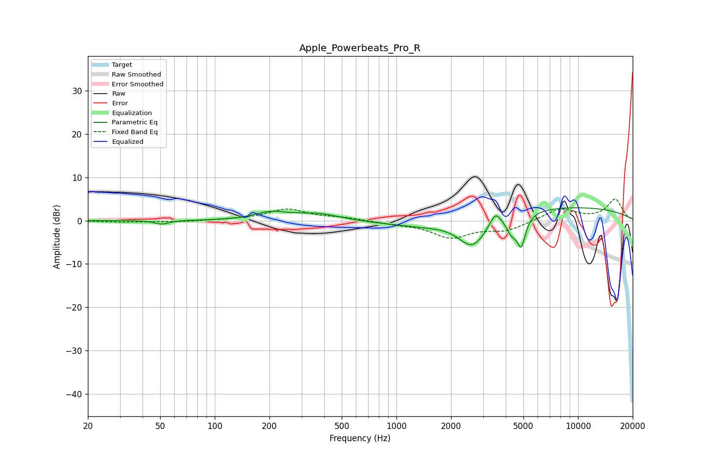

# Apple_Powerbeats_Pro_R
See [usage instructions](https://github.com/jaakkopasanen/AutoEq#usage) for more options and info.

### Parametric EQs
Apply preamp of -3.1 dB when using parametric equalizer.

|   # | Type    |   Fc (Hz) |    Q |   Gain (dB) |
|-----|---------|-----------|------|-------------|
|   1 | Peaking |        51 | 3.82 |        -0.9 |
|   2 | Peaking |       202 | 1.67 |         1.6 |
|   3 | Peaking |       366 | 0.99 |         1.8 |
|   4 | Peaking |      1459 | 0.94 |        -1.1 |
|   5 | Peaking |      2626 | 1.71 |        -7.2 |
|   6 | Peaking |      3508 | 4.56 |         3.2 |
|   7 | Peaking |      4060 | 0.19 |        -4   |
|   8 | Peaking |      4311 | 4.75 |        -3.4 |
|   9 | Peaking |      4873 | 6    |        -6.9 |
|  10 | Peaking |      5920 | 0.22 |         7.1 |

### Fixed Band EQs
When using fixed band (also called graphic) equalizer, apply preamp of **-5.1 dB** (if available) and set gains manually with these parameters.

|   # | Type    |   Fc (Hz) |    Q |   Gain (dB) |
|-----|---------|-----------|------|-------------|
|   1 | Peaking |        31 | 1.41 |        -0.3 |
|   2 | Peaking |        62 | 1.41 |        -0.3 |
|   3 | Peaking |       125 | 1.41 |         0.1 |
|   4 | Peaking |       250 | 1.41 |         2.6 |
|   5 | Peaking |       500 | 1.41 |         0.6 |
|   6 | Peaking |      1000 | 1.41 |        -0.6 |
|   7 | Peaking |      2000 | 1.41 |        -3.7 |
|   8 | Peaking |      4000 | 1.41 |        -2.1 |
|   9 | Peaking |      8000 | 1.41 |         2.8 |
|  10 | Peaking |     16000 | 1.41 |         4.9 |

### Graphs

