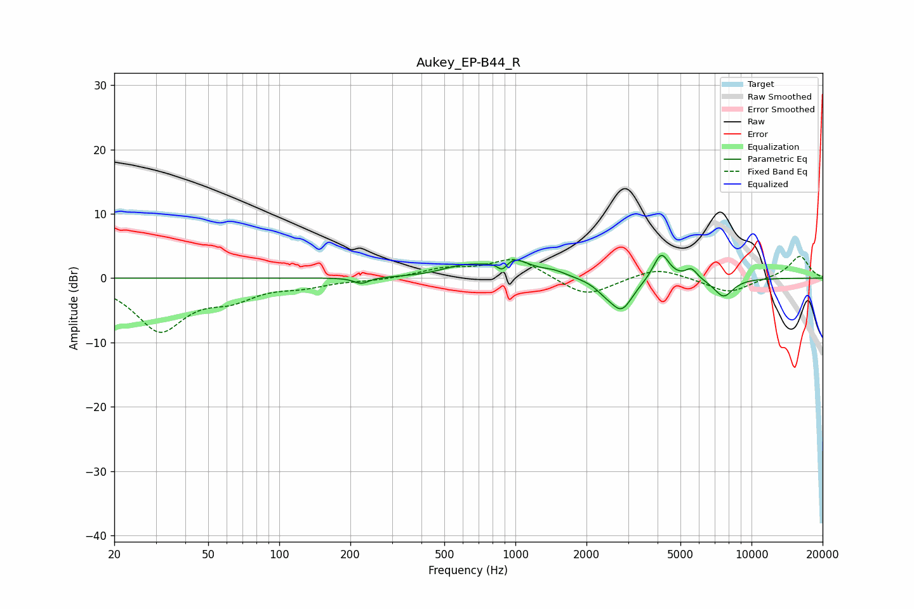

# Aukey_EP-B44_R
See [usage instructions](https://github.com/jaakkopasanen/AutoEq#usage) for more options and info.

### Parametric EQs
Apply preamp of -3.6 dB when using parametric equalizer.

|   # | Type    |   Fc (Hz) |    Q |   Gain (dB) |
|-----|---------|-----------|------|-------------|
|   1 | Peaking |       223 | 4.5  |        -1   |
|   2 | Peaking |       601 | 1.5  |         1.5 |
|   3 | Peaking |       881 | 6    |        -1.9 |
|   4 | Peaking |       954 | 1.95 |         3   |
|   5 | Peaking |      1456 | 2.6  |         0.7 |
|   6 | Peaking |      2392 | 3.4  |        -1   |
|   7 | Peaking |      2819 | 2.88 |        -4.8 |
|   8 | Peaking |      4145 | 4.17 |         4.3 |
|   9 | Peaking |      5564 | 5.47 |         1.6 |
|  10 | Peaking |      7613 | 3.16 |        -2.9 |

### Fixed Band EQs
When using fixed band (also called graphic) equalizer, apply preamp of **-3.5 dB** (if available) and set gains manually with these parameters.

|   # | Type    |   Fc (Hz) |    Q |   Gain (dB) |
|-----|---------|-----------|------|-------------|
|   1 | Peaking |        31 | 1.41 |        -7.9 |
|   2 | Peaking |        62 | 1.41 |        -2.5 |
|   3 | Peaking |       125 | 1.41 |        -1   |
|   4 | Peaking |       250 | 1.41 |        -0.3 |
|   5 | Peaking |       500 | 1.41 |         1.3 |
|   6 | Peaking |      1000 | 1.41 |         3.1 |
|   7 | Peaking |      2000 | 1.41 |        -3   |
|   8 | Peaking |      4000 | 1.41 |         1.7 |
|   9 | Peaking |      8000 | 1.41 |        -2.3 |
|  10 | Peaking |     16000 | 1.41 |         3.5 |

### Graphs

