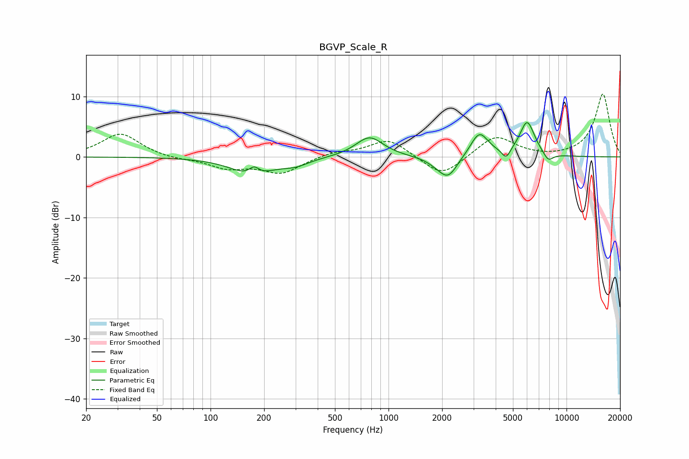

# BGVP_Scale_R
See [usage instructions](https://github.com/jaakkopasanen/AutoEq#usage) for more options and info.

### Parametric EQs
Apply preamp of -5.8 dB when using parametric equalizer.

|   # | Type    |   Fc (Hz) |    Q |   Gain (dB) |
|-----|---------|-----------|------|-------------|
|   1 | Peaking |       172 | 1.24 |        -3   |
|   2 | Peaking |       176 | 4.9  |         1.4 |
|   3 | Peaking |       301 | 1.93 |        -1   |
|   4 | Peaking |       782 | 1.83 |         3.4 |
|   5 | Peaking |      1917 | 2.27 |        -0.8 |
|   6 | Peaking |      2169 | 2.69 |        -3.2 |
|   7 | Peaking |      3238 | 2.81 |         4.1 |
|   8 | Peaking |      4578 | 6    |        -1.7 |
|   9 | Peaking |      6010 | 3.25 |         5.8 |
|  10 | Peaking |      7890 | 4.68 |        -1.4 |

### Fixed Band EQs
When using fixed band (also called graphic) equalizer, apply preamp of **-10.5 dB** (if available) and set gains manually with these parameters.

|   # | Type    |   Fc (Hz) |    Q |   Gain (dB) |
|-----|---------|-----------|------|-------------|
|   1 | Peaking |        31 | 1.41 |         3.9 |
|   2 | Peaking |        62 | 1.41 |        -0.4 |
|   3 | Peaking |       125 | 1.41 |        -1.7 |
|   4 | Peaking |       250 | 1.41 |        -2.6 |
|   5 | Peaking |       500 | 1.41 |         0.8 |
|   6 | Peaking |      1000 | 1.41 |         3   |
|   7 | Peaking |      2000 | 1.41 |        -3.5 |
|   8 | Peaking |      4000 | 1.41 |         3.6 |
|   9 | Peaking |      8000 | 1.41 |        -0.2 |
|  10 | Peaking |     16000 | 1.41 |        10.4 |

### Graphs

