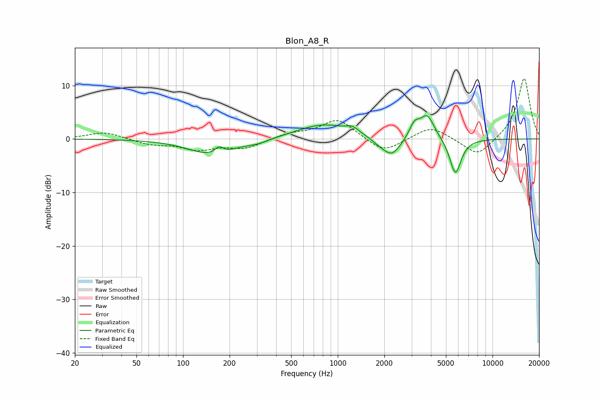

# Blon_A8_R
See [usage instructions](https://github.com/jaakkopasanen/AutoEq#usage) for more options and info.

### Parametric EQs
Apply preamp of -4.4 dB when using parametric equalizer.

|   # | Type    |   Fc (Hz) |    Q |   Gain (dB) |
|-----|---------|-----------|------|-------------|
|   1 | Peaking |       154 | 0.96 |        -3   |
|   2 | Peaking |       171 | 5.14 |         1.3 |
|   3 | Peaking |       307 | 2.05 |        -0.6 |
|   4 | Peaking |       811 | 0.82 |         2.8 |
|   5 | Peaking |      1241 | 3.62 |         1   |
|   6 | Peaking |      1847 | 2.79 |        -0.7 |
|   7 | Peaking |      2238 | 2.39 |        -3.4 |
|   8 | Peaking |      3125 | 4.35 |         2.4 |
|   9 | Peaking |      3781 | 2.92 |         4.5 |
|  10 | Peaking |      5755 | 3.73 |        -6.8 |

### Fixed Band EQs
When using fixed band (also called graphic) equalizer, apply preamp of **-11.4 dB** (if available) and set gains manually with these parameters.

|   # | Type    |   Fc (Hz) |    Q |   Gain (dB) |
|-----|---------|-----------|------|-------------|
|   1 | Peaking |        31 | 1.41 |         1.3 |
|   2 | Peaking |        62 | 1.41 |        -1   |
|   3 | Peaking |       125 | 1.41 |        -1.8 |
|   4 | Peaking |       250 | 1.41 |        -1.7 |
|   5 | Peaking |       500 | 1.41 |         0.9 |
|   6 | Peaking |      1000 | 1.41 |         3.7 |
|   7 | Peaking |      2000 | 1.41 |        -2.7 |
|   8 | Peaking |      4000 | 1.41 |         2.5 |
|   9 | Peaking |      8000 | 1.41 |        -3.4 |
|  10 | Peaking |     16000 | 1.41 |        11.5 |

### Graphs

