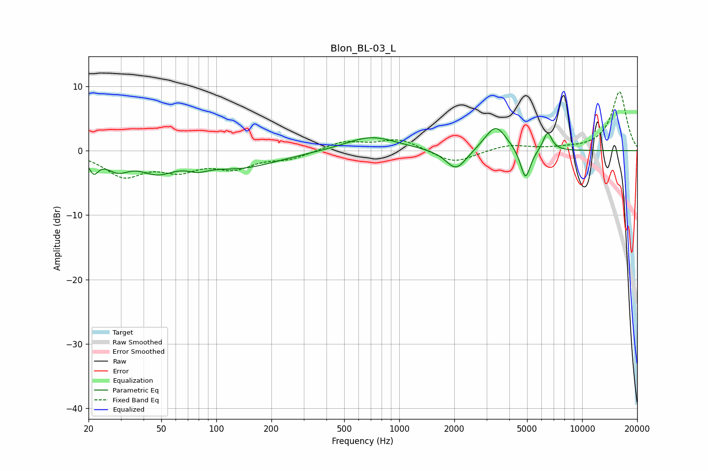

# Blon_BL-03_L
See [usage instructions](https://github.com/jaakkopasanen/AutoEq#usage) for more options and info.

### Parametric EQs
Apply preamp of -3.5 dB when using parametric equalizer.

|   # | Type    |   Fc (Hz) |    Q |   Gain (dB) |
|-----|---------|-----------|------|-------------|
|   1 | Peaking |        21 | 5.51 |        -2.4 |
|   2 | Peaking |        29 | 2.29 |        -2.3 |
|   3 | Peaking |        47 | 1.49 |        -2.6 |
|   4 | Peaking |        79 | 2.65 |        -1   |
|   5 | Peaking |       134 | 0.67 |        -2.5 |
|   6 | Peaking |       702 | 1    |         2.3 |
|   7 | Peaking |      2047 | 2.45 |        -3.3 |
|   8 | Peaking |      3366 | 2.37 |         4   |
|   9 | Peaking |      4899 | 5.03 |        -4.9 |
|  10 | Peaking |      6468 | 5.75 |         2.9 |

### Fixed Band EQs
When using fixed band (also called graphic) equalizer, apply preamp of **-9.2 dB** (if available) and set gains manually with these parameters.

|   # | Type    |   Fc (Hz) |    Q |   Gain (dB) |
|-----|---------|-----------|------|-------------|
|   1 | Peaking |        31 | 1.41 |        -3.7 |
|   2 | Peaking |        62 | 1.41 |        -2.5 |
|   3 | Peaking |       125 | 1.41 |        -2.4 |
|   4 | Peaking |       250 | 1.41 |        -1.1 |
|   5 | Peaking |       500 | 1.41 |         1.4 |
|   6 | Peaking |      1000 | 1.41 |         1.8 |
|   7 | Peaking |      2000 | 1.41 |        -2   |
|   8 | Peaking |      4000 | 1.41 |         0.9 |
|   9 | Peaking |      8000 | 1.41 |         0.2 |
|  10 | Peaking |     16000 | 1.41 |         9.2 |

### Graphs

