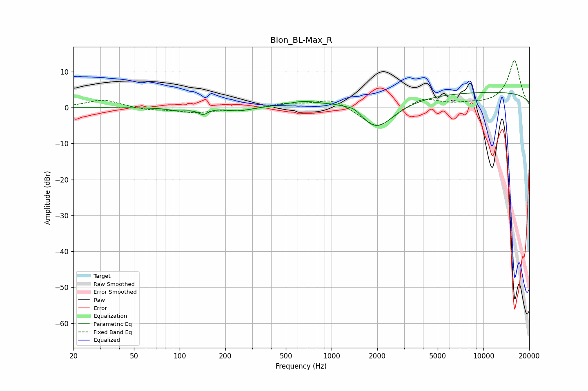

# Blon_BL-Max_R
See [usage instructions](https://github.com/jaakkopasanen/AutoEq#usage) for more options and info.

### Parametric EQs
Apply preamp of -4.3 dB when using parametric equalizer.

|   # | Type    |   Fc (Hz) |    Q |   Gain (dB) |
|-----|---------|-----------|------|-------------|
|   1 | Peaking |        99 | 2.3  |        -0.8 |
|   2 | Peaking |       142 | 4.53 |        -1.6 |
|   3 | Peaking |       245 | 1.9  |        -1   |
|   4 | Peaking |       667 | 1.21 |         1.9 |
|   5 | Peaking |      1040 | 2.37 |         0.7 |
|   6 | Peaking |      1427 | 2.04 |         3.6 |
|   7 | Peaking |      1529 | 1.54 |        -2.3 |
|   8 | Peaking |      2006 | 1.2  |        -6.4 |
|   9 | Peaking |      2016 | 1.51 |        -0.7 |
|  10 | Peaking |     10000 | 0.18 |         4.3 |

### Fixed Band EQs
When using fixed band (also called graphic) equalizer, apply preamp of **-13.2 dB** (if available) and set gains manually with these parameters.

|   # | Type    |   Fc (Hz) |    Q |   Gain (dB) |
|-----|---------|-----------|------|-------------|
|   1 | Peaking |        31 | 1.41 |         2.2 |
|   2 | Peaking |        62 | 1.41 |        -0.7 |
|   3 | Peaking |       125 | 1.41 |        -1.3 |
|   4 | Peaking |       250 | 1.41 |        -0.8 |
|   5 | Peaking |       500 | 1.41 |         1.1 |
|   6 | Peaking |      1000 | 1.41 |         2.6 |
|   7 | Peaking |      2000 | 1.41 |        -6   |
|   8 | Peaking |      4000 | 1.41 |         2.9 |
|   9 | Peaking |      8000 | 1.41 |         0.7 |
|  10 | Peaking |     16000 | 1.41 |        13.1 |

### Graphs

