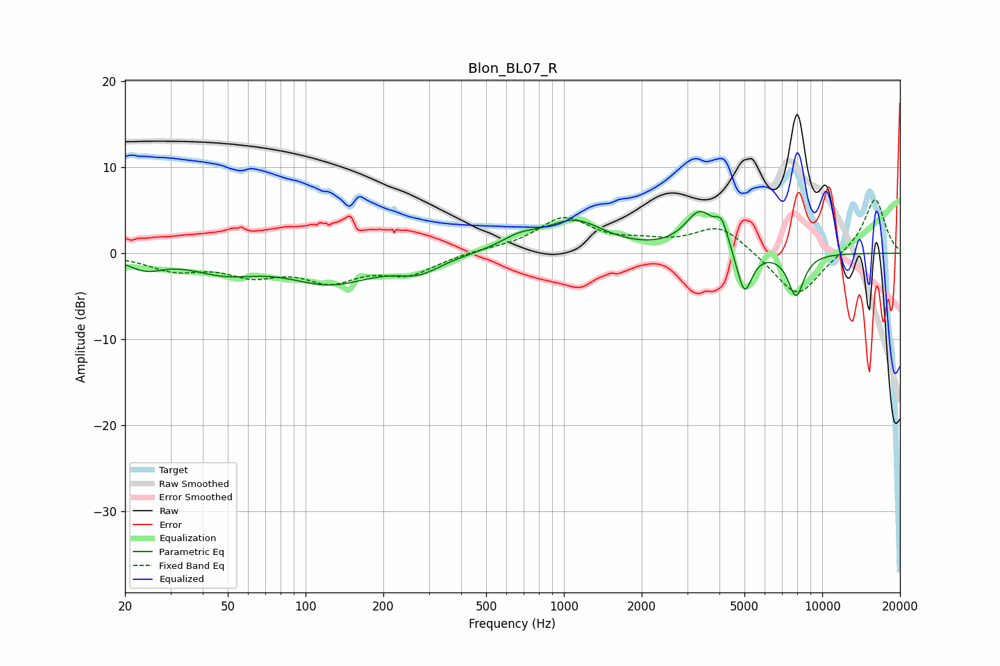

# Blon_BL07_R
See [usage instructions](https://github.com/jaakkopasanen/AutoEq#usage) for more options and info.

### Parametric EQs
Apply preamp of -4.9 dB when using parametric equalizer.

|   # | Type    |   Fc (Hz) |    Q |   Gain (dB) |
|-----|---------|-----------|------|-------------|
|   1 | Peaking |        24 | 2.13 |        -1.4 |
|   2 | Peaking |        48 | 1.12 |        -1.8 |
|   3 | Peaking |       125 | 0.85 |        -3.3 |
|   4 | Peaking |       275 | 1.67 |        -1.7 |
|   5 | Peaking |       672 | 1.88 |         1.3 |
|   6 | Peaking |      1100 | 1.23 |         3.6 |
|   7 | Peaking |      3360 | 2.43 |         4.5 |
|   8 | Peaking |      4080 | 5.65 |         2.6 |
|   9 | Peaking |      4997 | 4.67 |        -5.3 |
|  10 | Peaking |      7920 | 4.22 |        -5   |

### Fixed Band EQs
When using fixed band (also called graphic) equalizer, apply preamp of **-6.3 dB** (if available) and set gains manually with these parameters.

|   # | Type    |   Fc (Hz) |    Q |   Gain (dB) |
|-----|---------|-----------|------|-------------|
|   1 | Peaking |        31 | 1.41 |        -1.8 |
|   2 | Peaking |        62 | 1.41 |        -2.1 |
|   3 | Peaking |       125 | 1.41 |        -2.8 |
|   4 | Peaking |       250 | 1.41 |        -2.2 |
|   5 | Peaking |       500 | 1.41 |         0.3 |
|   6 | Peaking |      1000 | 1.41 |         4   |
|   7 | Peaking |      2000 | 1.41 |         0.9 |
|   8 | Peaking |      4000 | 1.41 |         3.2 |
|   9 | Peaking |      8000 | 1.41 |        -5.3 |
|  10 | Peaking |     16000 | 1.41 |         6.5 |

### Graphs

