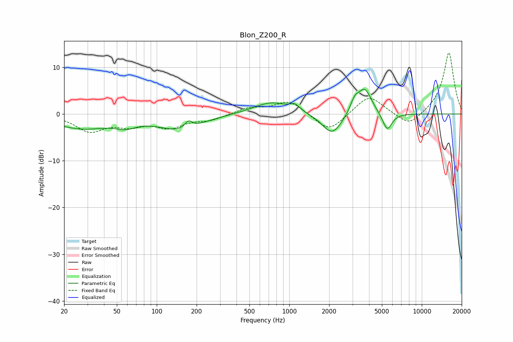

# Blon_Z200_R
See [usage instructions](https://github.com/jaakkopasanen/AutoEq#usage) for more options and info.

### Parametric EQs
Apply preamp of -5.4 dB when using parametric equalizer.

|   # | Type    |   Fc (Hz) |    Q |   Gain (dB) |
|-----|---------|-----------|------|-------------|
|   1 | Peaking |        27 | 0.68 |        -2.9 |
|   2 | Peaking |        58 | 1.81 |        -1.4 |
|   3 | Peaking |       150 | 0.87 |        -3.2 |
|   4 | Peaking |       174 | 5.05 |         1.6 |
|   5 | Peaking |       732 | 1.04 |         2.6 |
|   6 | Peaking |      1102 | 3.83 |         1.3 |
|   7 | Peaking |      2107 | 1.9  |        -4.6 |
|   8 | Peaking |      3118 | 4.17 |         2.6 |
|   9 | Peaking |      3720 | 2.71 |         5.4 |
|  10 | Peaking |      5486 | 3.9  |        -3.8 |

### Fixed Band EQs
When using fixed band (also called graphic) equalizer, apply preamp of **-13.2 dB** (if available) and set gains manually with these parameters.

|   # | Type    |   Fc (Hz) |    Q |   Gain (dB) |
|-----|---------|-----------|------|-------------|
|   1 | Peaking |        31 | 1.41 |        -3.5 |
|   2 | Peaking |        62 | 1.41 |        -2   |
|   3 | Peaking |       125 | 1.41 |        -2.6 |
|   4 | Peaking |       250 | 1.41 |        -1.2 |
|   5 | Peaking |       500 | 1.41 |         1.3 |
|   6 | Peaking |      1000 | 1.41 |         2.9 |
|   7 | Peaking |      2000 | 1.41 |        -4   |
|   8 | Peaking |      4000 | 1.41 |         4.1 |
|   9 | Peaking |      8000 | 1.41 |        -2.9 |
|  10 | Peaking |     16000 | 1.41 |        13.3 |

### Graphs

