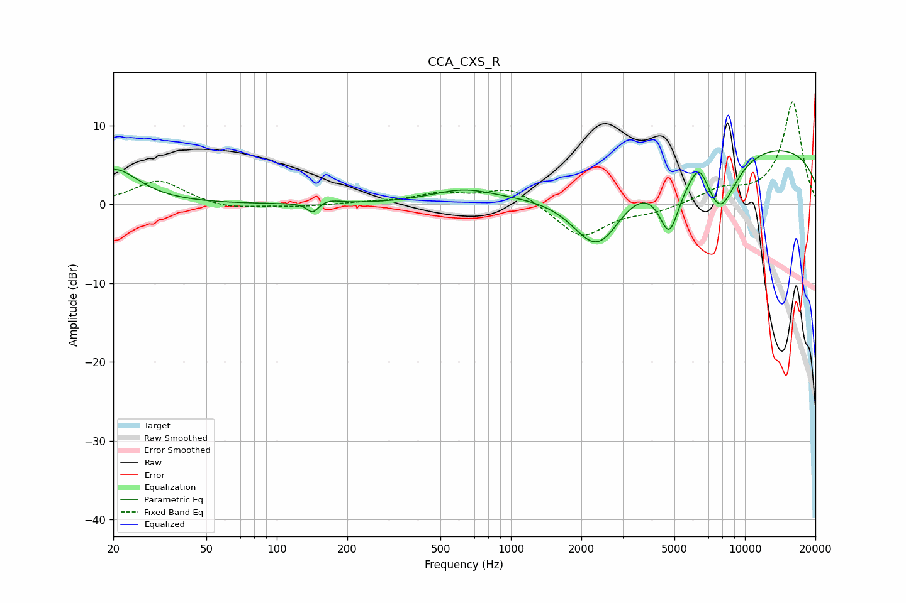

# CCA_CXS_R
See [usage instructions](https://github.com/jaakkopasanen/AutoEq#usage) for more options and info.

### Parametric EQs
Apply preamp of -6.9 dB when using parametric equalizer.

|   # | Type    |   Fc (Hz) |    Q |   Gain (dB) |
|-----|---------|-----------|------|-------------|
|   1 | Peaking |        20 | 1.37 |         4.4 |
|   2 | Peaking |       142 | 5.87 |        -1.3 |
|   3 | Peaking |       167 | 3.11 |         0.5 |
|   4 | Peaking |       624 | 1.05 |         1.6 |
|   5 | Peaking |      2277 | 1.25 |        -6.3 |
|   6 | Peaking |      2469 | 1.55 |        -2.5 |
|   7 | Peaking |      4749 | 3.01 |        -7.4 |
|   8 | Peaking |      6392 | 3.52 |         3.1 |
|   9 | Peaking |      7813 | 1.77 |        -7.5 |
|  10 | Peaking |      9983 | 0.18 |         7.9 |

### Fixed Band EQs
When using fixed band (also called graphic) equalizer, apply preamp of **-13.1 dB** (if available) and set gains manually with these parameters.

|   # | Type    |   Fc (Hz) |    Q |   Gain (dB) |
|-----|---------|-----------|------|-------------|
|   1 | Peaking |        31 | 1.41 |         3.1 |
|   2 | Peaking |        62 | 1.41 |        -0.7 |
|   3 | Peaking |       125 | 1.41 |        -0.3 |
|   4 | Peaking |       250 | 1.41 |         0.2 |
|   5 | Peaking |       500 | 1.41 |         1.3 |
|   6 | Peaking |      1000 | 1.41 |         2.3 |
|   7 | Peaking |      2000 | 1.41 |        -4.3 |
|   8 | Peaking |      4000 | 1.41 |        -0.9 |
|   9 | Peaking |      8000 | 1.41 |         1.7 |
|  10 | Peaking |     16000 | 1.41 |        13.1 |

### Graphs

