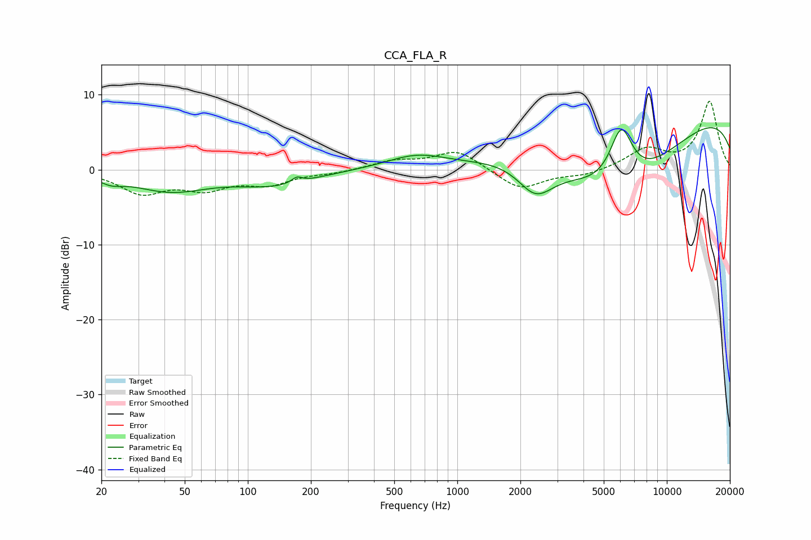

# CCA_FLA_R
See [usage instructions](https://github.com/jaakkopasanen/AutoEq#usage) for more options and info.

### Parametric EQs
Apply preamp of -5.7 dB when using parametric equalizer.

|   # | Type    |   Fc (Hz) |    Q |   Gain (dB) |
|-----|---------|-----------|------|-------------|
|   1 | Peaking |        22 | 2.6  |        -0.9 |
|   2 | Peaking |        42 | 0.79 |        -2.7 |
|   3 | Peaking |       134 | 0.76 |        -1.9 |
|   4 | Peaking |       171 | 5.83 |         0.8 |
|   5 | Peaking |       639 | 0.98 |         1.8 |
|   6 | Peaking |      1925 | 0.83 |         1   |
|   7 | Peaking |      2358 | 1.6  |        -4.5 |
|   8 | Peaking |      5929 | 0.5  |       -11.1 |
|   9 | Peaking |      6057 | 2.33 |         8.3 |
|  10 | Peaking |     10000 | 0.18 |         8.8 |

### Fixed Band EQs
When using fixed band (also called graphic) equalizer, apply preamp of **-9.2 dB** (if available) and set gains manually with these parameters.

|   # | Type    |   Fc (Hz) |    Q |   Gain (dB) |
|-----|---------|-----------|------|-------------|
|   1 | Peaking |        31 | 1.41 |        -2.9 |
|   2 | Peaking |        62 | 1.41 |        -2.2 |
|   3 | Peaking |       125 | 1.41 |        -1.7 |
|   4 | Peaking |       250 | 1.41 |        -0.4 |
|   5 | Peaking |       500 | 1.41 |         1.1 |
|   6 | Peaking |      1000 | 1.41 |         2.6 |
|   7 | Peaking |      2000 | 1.41 |        -2.7 |
|   8 | Peaking |      4000 | 1.41 |        -0.7 |
|   9 | Peaking |      8000 | 1.41 |         2.6 |
|  10 | Peaking |     16000 | 1.41 |         9.1 |

### Graphs

