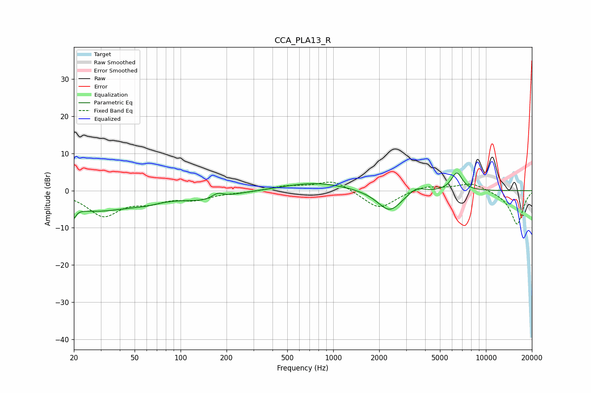

# CCA_PLA13_R
See [usage instructions](https://github.com/jaakkopasanen/AutoEq#usage) for more options and info.

### Parametric EQs
Apply preamp of -4.8 dB when using parametric equalizer.

|   # | Type    |   Fc (Hz) |    Q |   Gain (dB) |
|-----|---------|-----------|------|-------------|
|   1 | Peaking |        20 | 5.87 |        -5.9 |
|   2 | Peaking |        20 | 5.76 |         3.1 |
|   3 | Peaking |        28 | 0.57 |        -5.1 |
|   4 | Peaking |        59 | 1.42 |        -1   |
|   5 | Peaking |       147 | 0.93 |        -2.2 |
|   6 | Peaking |       175 | 3.83 |         1.5 |
|   7 | Peaking |       772 | 0.68 |         2.2 |
|   8 | Peaking |      2337 | 1.77 |        -5.8 |
|   9 | Peaking |      3489 | 2.79 |         1.8 |
|  10 | Peaking |      6443 | 3.81 |         4.9 |

### Fixed Band EQs
When using fixed band (also called graphic) equalizer, apply preamp of **-2.4 dB** (if available) and set gains manually with these parameters.

|   # | Type    |   Fc (Hz) |    Q |   Gain (dB) |
|-----|---------|-----------|------|-------------|
|   1 | Peaking |        31 | 1.41 |        -6.5 |
|   2 | Peaking |        62 | 1.41 |        -2.4 |
|   3 | Peaking |       125 | 1.41 |        -2.1 |
|   4 | Peaking |       250 | 1.41 |        -0.4 |
|   5 | Peaking |       500 | 1.41 |         1.2 |
|   6 | Peaking |      1000 | 1.41 |         2.9 |
|   7 | Peaking |      2000 | 1.41 |        -5.1 |
|   8 | Peaking |      4000 | 1.41 |         1.4 |
|   9 | Peaking |      8000 | 1.41 |         2.2 |
|  10 | Peaking |     16000 | 1.41 |        -9.1 |

### Graphs

