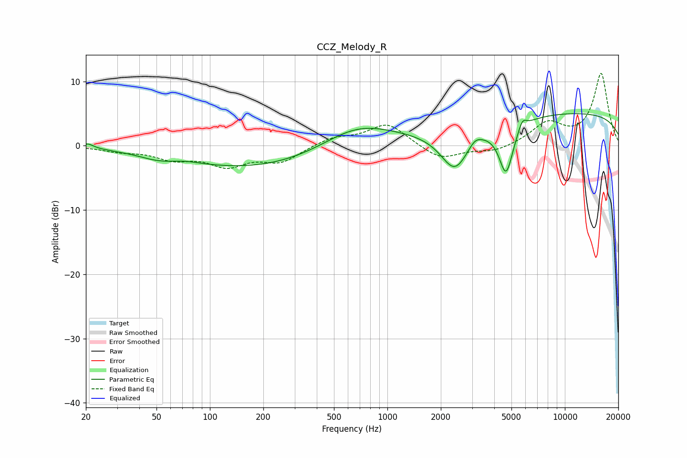

# CCZ_Melody_R
See [usage instructions](https://github.com/jaakkopasanen/AutoEq#usage) for more options and info.

### Parametric EQs
Apply preamp of -5.1 dB when using parametric equalizer.

|   # | Type    |   Fc (Hz) |    Q |   Gain (dB) |
|-----|---------|-----------|------|-------------|
|   1 | Peaking |        20 | 4.24 |         0.7 |
|   2 | Peaking |        51 | 1.42 |        -0.7 |
|   3 | Peaking |        72 | 1.74 |         0.3 |
|   4 | Peaking |       203 | 0.28 |        -3.7 |
|   5 | Peaking |       670 | 0.65 |         4.4 |
|   6 | Peaking |      2400 | 1.73 |        -6.5 |
|   7 | Peaking |      3115 | 3.97 |         1.1 |
|   8 | Peaking |      4664 | 3.42 |        -7.9 |
|   9 | Peaking |      5758 | 6    |         1.6 |
|  10 | Peaking |     10000 | 0.18 |         5.1 |

### Fixed Band EQs
When using fixed band (also called graphic) equalizer, apply preamp of **-11.3 dB** (if available) and set gains manually with these parameters.

|   # | Type    |   Fc (Hz) |    Q |   Gain (dB) |
|-----|---------|-----------|------|-------------|
|   1 | Peaking |        31 | 1.41 |        -0.7 |
|   2 | Peaking |        62 | 1.41 |        -1.8 |
|   3 | Peaking |       125 | 1.41 |        -2.8 |
|   4 | Peaking |       250 | 1.41 |        -2.4 |
|   5 | Peaking |       500 | 1.41 |         1.2 |
|   6 | Peaking |      1000 | 1.41 |         3.5 |
|   7 | Peaking |      2000 | 1.41 |        -2.2 |
|   8 | Peaking |      4000 | 1.41 |        -1   |
|   9 | Peaking |      8000 | 1.41 |         3.3 |
|  10 | Peaking |     16000 | 1.41 |        11.2 |

### Graphs

