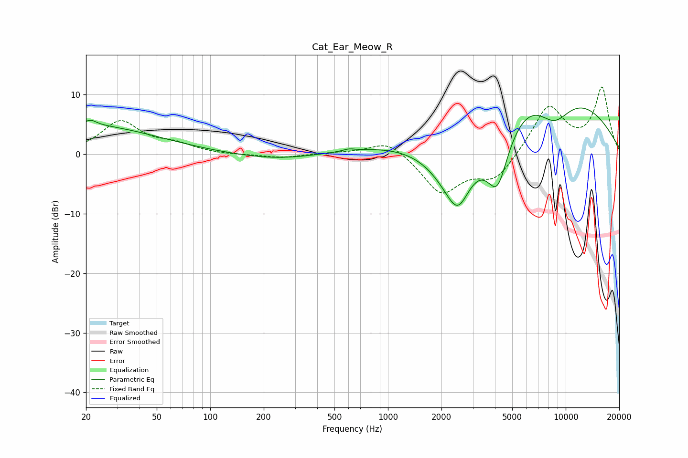

# Cat_Ear_Meow_R
See [usage instructions](https://github.com/jaakkopasanen/AutoEq#usage) for more options and info.

### Parametric EQs
Apply preamp of -7.8 dB when using parametric equalizer.

|   # | Type    |   Fc (Hz) |    Q |   Gain (dB) |
|-----|---------|-----------|------|-------------|
|   1 | Peaking |        20 | 0.36 |         4.8 |
|   2 | Peaking |        21 | 4.31 |         0.9 |
|   3 | Peaking |       238 | 0.62 |        -1   |
|   4 | Peaking |       601 | 4.6  |         0.4 |
|   5 | Peaking |      2355 | 0.75 |       -14.3 |
|   6 | Peaking |      2485 | 2.38 |        -4.5 |
|   7 | Peaking |      2765 | 0.29 |         4.8 |
|   8 | Peaking |      4130 | 1.9  |       -11.9 |
|   9 | Peaking |      6760 | 0.28 |        13.1 |
|  10 | Peaking |      8582 | 1.21 |        -6.4 |

### Fixed Band EQs
When using fixed band (also called graphic) equalizer, apply preamp of **-11.4 dB** (if available) and set gains manually with these parameters.

|   # | Type    |   Fc (Hz) |    Q |   Gain (dB) |
|-----|---------|-----------|------|-------------|
|   1 | Peaking |        31 | 1.41 |         5.4 |
|   2 | Peaking |        62 | 1.41 |         1.4 |
|   3 | Peaking |       125 | 1.41 |        -0.2 |
|   4 | Peaking |       250 | 1.41 |        -0.6 |
|   5 | Peaking |       500 | 1.41 |         0.2 |
|   6 | Peaking |      1000 | 1.41 |         2.6 |
|   7 | Peaking |      2000 | 1.41 |        -6.5 |
|   8 | Peaking |      4000 | 1.41 |        -4.2 |
|   9 | Peaking |      8000 | 1.41 |         8.1 |
|  10 | Peaking |     16000 | 1.41 |        10.9 |

### Graphs

