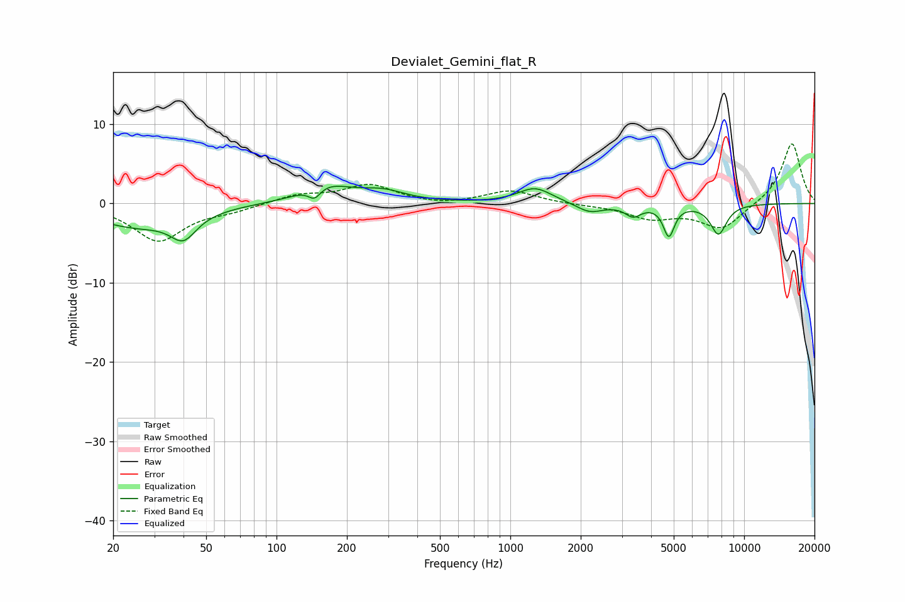

# Devialet_Gemini_flat_R
See [usage instructions](https://github.com/jaakkopasanen/AutoEq#usage) for more options and info.

### Parametric EQs
Apply preamp of -2.3 dB when using parametric equalizer.

|   # | Type    |   Fc (Hz) |    Q |   Gain (dB) |
|-----|---------|-----------|------|-------------|
|   1 | Peaking |        25 | 0.75 |        -2.8 |
|   2 | Peaking |        40 | 2.6  |        -3   |
|   3 | Peaking |       145 | 5.34 |        -1.4 |
|   4 | Peaking |       162 | 1.3  |         2.2 |
|   5 | Peaking |       285 | 1.47 |         1.3 |
|   6 | Peaking |      1276 | 1.94 |         2   |
|   7 | Peaking |      2187 | 2.47 |        -1.2 |
|   8 | Peaking |      3351 | 4.14 |        -1.4 |
|   9 | Peaking |      4765 | 5.95 |        -3.9 |
|  10 | Peaking |      7768 | 3.82 |        -3.8 |

### Fixed Band EQs
When using fixed band (also called graphic) equalizer, apply preamp of **-7.6 dB** (if available) and set gains manually with these parameters.

|   # | Type    |   Fc (Hz) |    Q |   Gain (dB) |
|-----|---------|-----------|------|-------------|
|   1 | Peaking |        31 | 1.41 |        -4.7 |
|   2 | Peaking |        62 | 1.41 |        -0.7 |
|   3 | Peaking |       125 | 1.41 |         1.1 |
|   4 | Peaking |       250 | 1.41 |         2.3 |
|   5 | Peaking |       500 | 1.41 |        -0.3 |
|   6 | Peaking |      1000 | 1.41 |         1.6 |
|   7 | Peaking |      2000 | 1.41 |        -0.1 |
|   8 | Peaking |      4000 | 1.41 |        -1.8 |
|   9 | Peaking |      8000 | 1.41 |        -3.2 |
|  10 | Peaking |     16000 | 1.41 |         7.7 |

### Graphs

