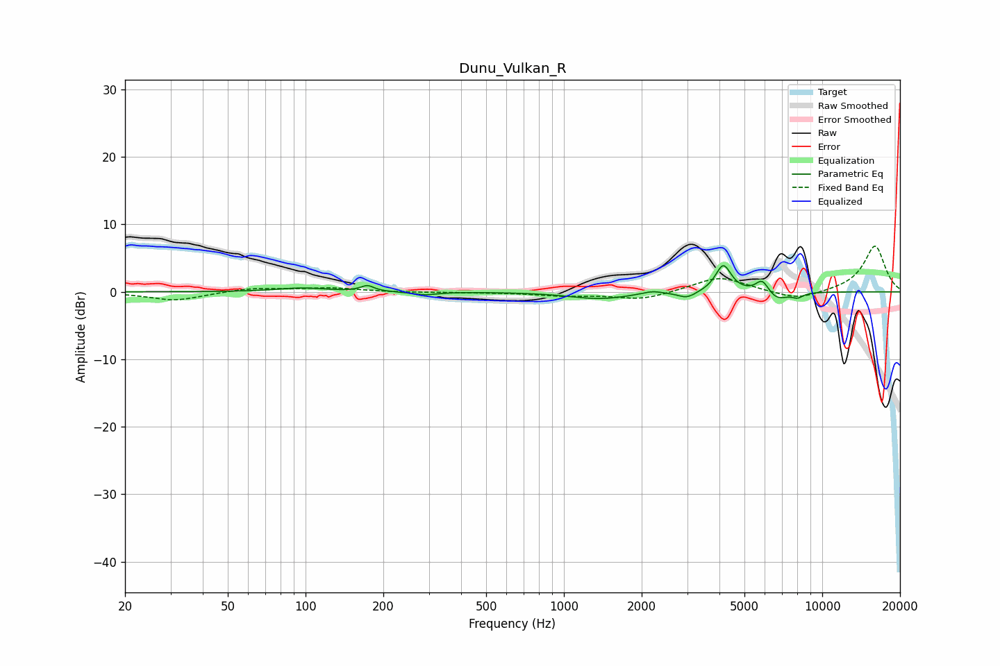

# Dunu_Vulkan_R
See [usage instructions](https://github.com/jaakkopasanen/AutoEq#usage) for more options and info.

### Parametric EQs
Apply preamp of -4.0 dB when using parametric equalizer.

|   # | Type    |   Fc (Hz) |    Q |   Gain (dB) |
|-----|---------|-----------|------|-------------|
|   1 | Peaking |        97 | 1.53 |         0.6 |
|   2 | Peaking |       173 | 5.63 |         0.8 |
|   3 | Peaking |       289 | 3.01 |        -0.5 |
|   4 | Peaking |      1377 | 1.19 |        -1   |
|   5 | Peaking |      2190 | 3.58 |         0.5 |
|   6 | Peaking |      2994 | 4.03 |        -0.9 |
|   7 | Peaking |      4140 | 4.68 |         4.1 |
|   8 | Peaking |      5864 | 5.43 |         2   |
|   9 | Peaking |      6660 | 3.31 |        -1.3 |
|  10 | Peaking |      8035 | 6    |        -0.7 |

### Fixed Band EQs
When using fixed band (also called graphic) equalizer, apply preamp of **-6.9 dB** (if available) and set gains manually with these parameters.

|   # | Type    |   Fc (Hz) |    Q |   Gain (dB) |
|-----|---------|-----------|------|-------------|
|   1 | Peaking |        31 | 1.41 |        -1.3 |
|   2 | Peaking |        62 | 1.41 |         0.6 |
|   3 | Peaking |       125 | 1.41 |         0.6 |
|   4 | Peaking |       250 | 1.41 |        -0.1 |
|   5 | Peaking |       500 | 1.41 |        -0.1 |
|   6 | Peaking |      1000 | 1.41 |        -0.5 |
|   7 | Peaking |      2000 | 1.41 |        -1.2 |
|   8 | Peaking |      4000 | 1.41 |         2.3 |
|   9 | Peaking |      8000 | 1.41 |        -1.3 |
|  10 | Peaking |     16000 | 1.41 |         6.8 |

### Graphs

