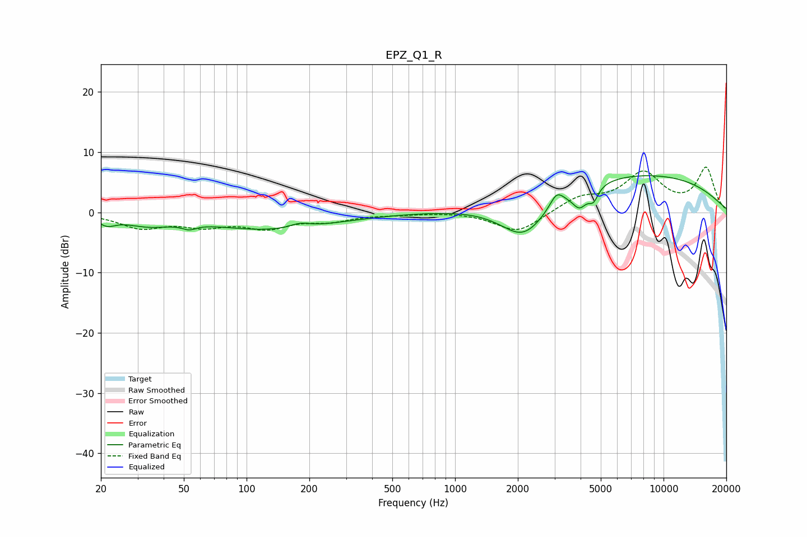

# EPZ_Q1_R
See [usage instructions](https://github.com/jaakkopasanen/AutoEq#usage) for more options and info.

### Parametric EQs
Apply preamp of -6.2 dB when using parametric equalizer.

|   # | Type    |   Fc (Hz) |    Q |   Gain (dB) |
|-----|---------|-----------|------|-------------|
|   1 | Peaking |        21 | 3.56 |        -1.3 |
|   2 | Peaking |        33 | 1.2  |        -1.7 |
|   3 | Peaking |        53 | 4.35 |        -0.8 |
|   4 | Peaking |       133 | 0.48 |        -2.8 |
|   5 | Peaking |       180 | 2.96 |         0.8 |
|   6 | Peaking |      2140 | 1.19 |        -7   |
|   7 | Peaking |      3070 | 4.42 |         2.3 |
|   8 | Peaking |      3956 | 4.05 |        -2.9 |
|   9 | Peaking |      4608 | 6    |        -2.2 |
|  10 | Peaking |      7089 | 0.26 |         6.5 |

### Fixed Band EQs
When using fixed band (also called graphic) equalizer, apply preamp of **-7.6 dB** (if available) and set gains manually with these parameters.

|   # | Type    |   Fc (Hz) |    Q |   Gain (dB) |
|-----|---------|-----------|------|-------------|
|   1 | Peaking |        31 | 1.41 |        -2.4 |
|   2 | Peaking |        62 | 1.41 |        -1.9 |
|   3 | Peaking |       125 | 1.41 |        -2.3 |
|   4 | Peaking |       250 | 1.41 |        -1.2 |
|   5 | Peaking |       500 | 1.41 |        -0.2 |
|   6 | Peaking |      1000 | 1.41 |         0.1 |
|   7 | Peaking |      2000 | 1.41 |        -3.4 |
|   8 | Peaking |      4000 | 1.41 |         2.3 |
|   9 | Peaking |      8000 | 1.41 |         6.2 |
|  10 | Peaking |     16000 | 1.41 |         7.2 |

### Graphs

