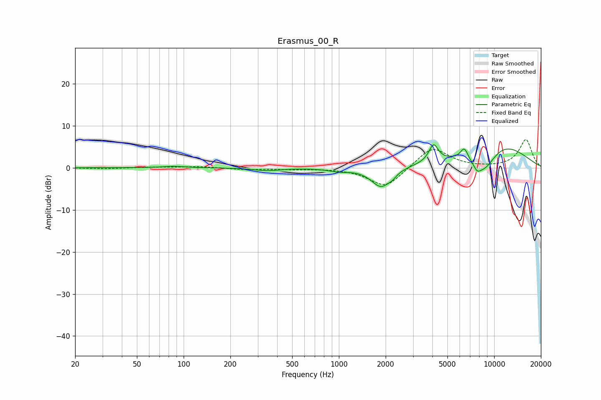

# Erasmus_00_R
See [usage instructions](https://github.com/jaakkopasanen/AutoEq#usage) for more options and info.

### Parametric EQs
Apply preamp of -5.5 dB when using parametric equalizer.

|   # | Type    |   Fc (Hz) |    Q |   Gain (dB) |
|-----|---------|-----------|------|-------------|
|   1 | Peaking |        86 | 2.02 |         0.4 |
|   2 | Peaking |       346 | 1.61 |        -0.6 |
|   3 | Peaking |       998 | 2.16 |        -0.7 |
|   4 | Peaking |      1872 | 2.19 |        -4.8 |
|   5 | Peaking |      2213 | 5.92 |        -0.7 |
|   6 | Peaking |      4071 | 4.73 |         4.1 |
|   7 | Peaking |      6426 | 5.49 |         2.9 |
|   8 | Peaking |      7766 | 6    |        -1.4 |
|   9 | Peaking |      8574 | 1.44 |        -7   |
|  10 | Peaking |     10000 | 0.57 |         7.5 |

### Fixed Band EQs
When using fixed band (also called graphic) equalizer, apply preamp of **-6.8 dB** (if available) and set gains manually with these parameters.

|   # | Type    |   Fc (Hz) |    Q |   Gain (dB) |
|-----|---------|-----------|------|-------------|
|   1 | Peaking |        31 | 1.41 |        -0.2 |
|   2 | Peaking |        62 | 1.41 |         0.2 |
|   3 | Peaking |       125 | 1.41 |         0.3 |
|   4 | Peaking |       250 | 1.41 |        -0.4 |
|   5 | Peaking |       500 | 1.41 |        -0.3 |
|   6 | Peaking |      1000 | 1.41 |        -0.1 |
|   7 | Peaking |      2000 | 1.41 |        -4.8 |
|   8 | Peaking |      4000 | 1.41 |         5.1 |
|   9 | Peaking |      8000 | 1.41 |        -0   |
|  10 | Peaking |     16000 | 1.41 |         6.7 |

### Graphs

