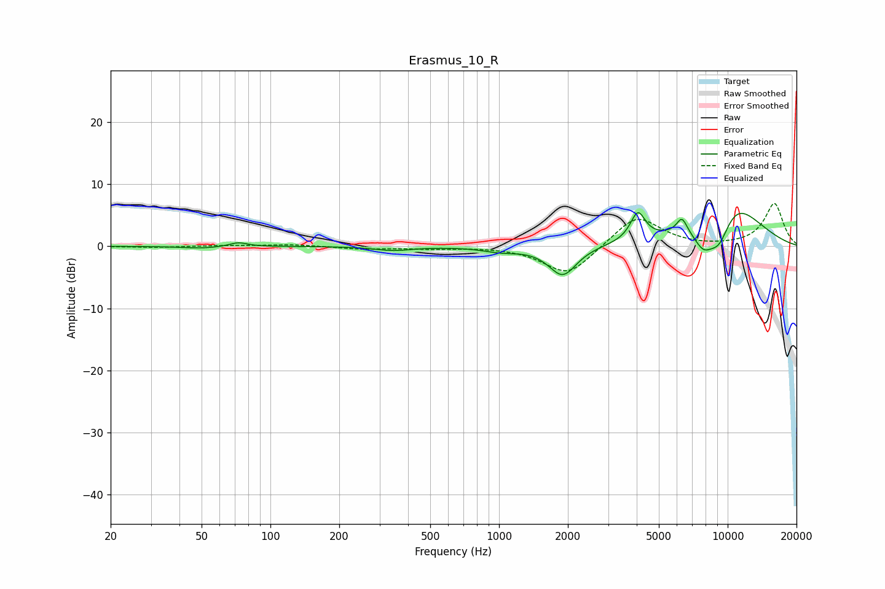

# Erasmus_10_R
See [usage instructions](https://github.com/jaakkopasanen/AutoEq#usage) for more options and info.

### Parametric EQs
Apply preamp of -5.5 dB when using parametric equalizer.

|   # | Type    |   Fc (Hz) |    Q |   Gain (dB) |
|-----|---------|-----------|------|-------------|
|   1 | Peaking |        50 | 1.68 |        -0.3 |
|   2 | Peaking |        72 | 3.62 |         0.7 |
|   3 | Peaking |       344 | 1.78 |        -0.6 |
|   4 | Peaking |      1018 | 1.81 |        -0.7 |
|   5 | Peaking |      1899 | 2.31 |        -4.8 |
|   6 | Peaking |      4046 | 4.31 |         4.5 |
|   7 | Peaking |      6309 | 6    |         2.4 |
|   8 | Peaking |      7816 | 2.94 |        -3.6 |
|   9 | Peaking |      9180 | 2.16 |        -6.9 |
|  10 | Peaking |     10000 | 0.88 |         9.1 |

### Fixed Band EQs
When using fixed band (also called graphic) equalizer, apply preamp of **-7.0 dB** (if available) and set gains manually with these parameters.

|   # | Type    |   Fc (Hz) |    Q |   Gain (dB) |
|-----|---------|-----------|------|-------------|
|   1 | Peaking |        31 | 1.41 |        -0.2 |
|   2 | Peaking |        62 | 1.41 |         0.1 |
|   3 | Peaking |       125 | 1.41 |         0.3 |
|   4 | Peaking |       250 | 1.41 |        -0.4 |
|   5 | Peaking |       500 | 1.41 |        -0.3 |
|   6 | Peaking |      1000 | 1.41 |         0   |
|   7 | Peaking |      2000 | 1.41 |        -4.8 |
|   8 | Peaking |      4000 | 1.41 |         5.1 |
|   9 | Peaking |      8000 | 1.41 |        -0.1 |
|  10 | Peaking |     16000 | 1.41 |         6.9 |

### Graphs

