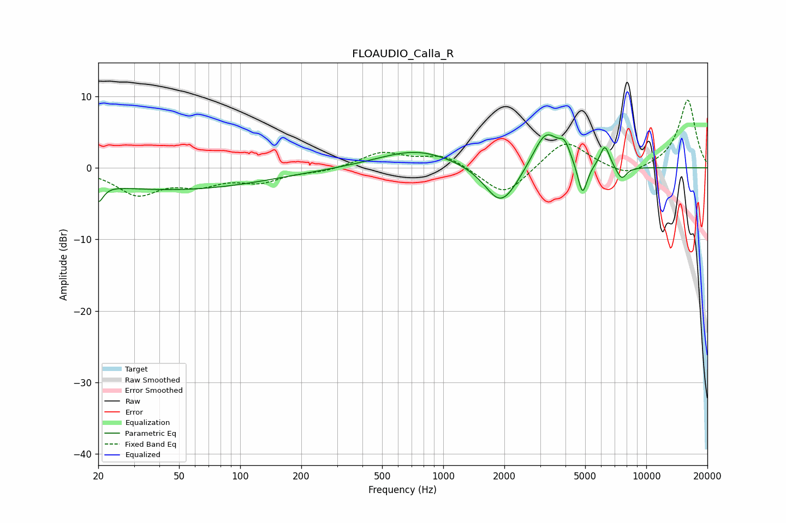

# FLOAUDIO_Calla_R
See [usage instructions](https://github.com/jaakkopasanen/AutoEq#usage) for more options and info.

### Parametric EQs
Apply preamp of -4.7 dB when using parametric equalizer.

|   # | Type    |   Fc (Hz) |    Q |   Gain (dB) |
|-----|---------|-----------|------|-------------|
|   1 | Peaking |        20 | 5.83 |        -2.5 |
|   2 | Peaking |        46 | 0.31 |        -3   |
|   3 | Peaking |       739 | 0.75 |         2.5 |
|   4 | Peaking |      1893 | 1.86 |        -4.5 |
|   5 | Peaking |      2123 | 1.72 |        -1.4 |
|   6 | Peaking |      3208 | 2.13 |         5.4 |
|   7 | Peaking |      3968 | 5.26 |         2   |
|   8 | Peaking |      4852 | 5.94 |        -4.7 |
|   9 | Peaking |      6251 | 5.74 |         3.1 |
|  10 | Peaking |      7555 | 5.15 |        -1.8 |

### Fixed Band EQs
When using fixed band (also called graphic) equalizer, apply preamp of **-9.6 dB** (if available) and set gains manually with these parameters.

|   # | Type    |   Fc (Hz) |    Q |   Gain (dB) |
|-----|---------|-----------|------|-------------|
|   1 | Peaking |        31 | 1.41 |        -3.5 |
|   2 | Peaking |        62 | 1.41 |        -2   |
|   3 | Peaking |       125 | 1.41 |        -1.7 |
|   4 | Peaking |       250 | 1.41 |        -0.5 |
|   5 | Peaking |       500 | 1.41 |         2.1 |
|   6 | Peaking |      1000 | 1.41 |         1.8 |
|   7 | Peaking |      2000 | 1.41 |        -4.1 |
|   8 | Peaking |      4000 | 1.41 |         4   |
|   9 | Peaking |      8000 | 1.41 |        -1.4 |
|  10 | Peaking |     16000 | 1.41 |         9.6 |

### Graphs

