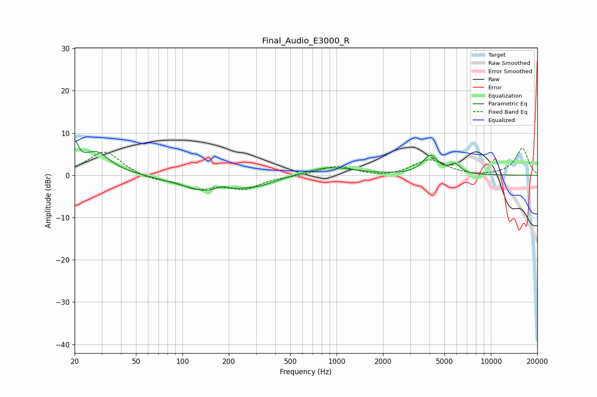

# Final_Audio_E3000_R
See [usage instructions](https://github.com/jaakkopasanen/AutoEq#usage) for more options and info.

### Parametric EQs
Apply preamp of -8.3 dB when using parametric equalizer.

|   # | Type    |   Fc (Hz) |    Q |   Gain (dB) |
|-----|---------|-----------|------|-------------|
|   1 | Peaking |        20 | 5.92 |         5.7 |
|   2 | Peaking |        27 | 1.62 |         4.4 |
|   3 | Peaking |        29 | 2.2  |         0.9 |
|   4 | Peaking |        42 | 1.2  |         0.5 |
|   5 | Peaking |       160 | 0.74 |        -4.1 |
|   6 | Peaking |       180 | 3    |         1.4 |
|   7 | Peaking |       322 | 1.38 |        -1.1 |
|   8 | Peaking |       902 | 0.91 |         2   |
|   9 | Peaking |      4043 | 2.89 |         4.4 |
|  10 | Peaking |      5868 | 4    |         2.1 |

### Fixed Band EQs
When using fixed band (also called graphic) equalizer, apply preamp of **-6.5 dB** (if available) and set gains manually with these parameters.

|   # | Type    |   Fc (Hz) |    Q |   Gain (dB) |
|-----|---------|-----------|------|-------------|
|   1 | Peaking |        31 | 1.41 |         5.8 |
|   2 | Peaking |        62 | 1.41 |        -1.1 |
|   3 | Peaking |       125 | 1.41 |        -2.9 |
|   4 | Peaking |       250 | 1.41 |        -2.9 |
|   5 | Peaking |       500 | 1.41 |        -0.1 |
|   6 | Peaking |      1000 | 1.41 |         2.2 |
|   7 | Peaking |      2000 | 1.41 |        -0.6 |
|   8 | Peaking |      4000 | 1.41 |         3.7 |
|   9 | Peaking |      8000 | 1.41 |        -0.3 |
|  10 | Peaking |     16000 | 1.41 |         6.4 |

### Graphs

