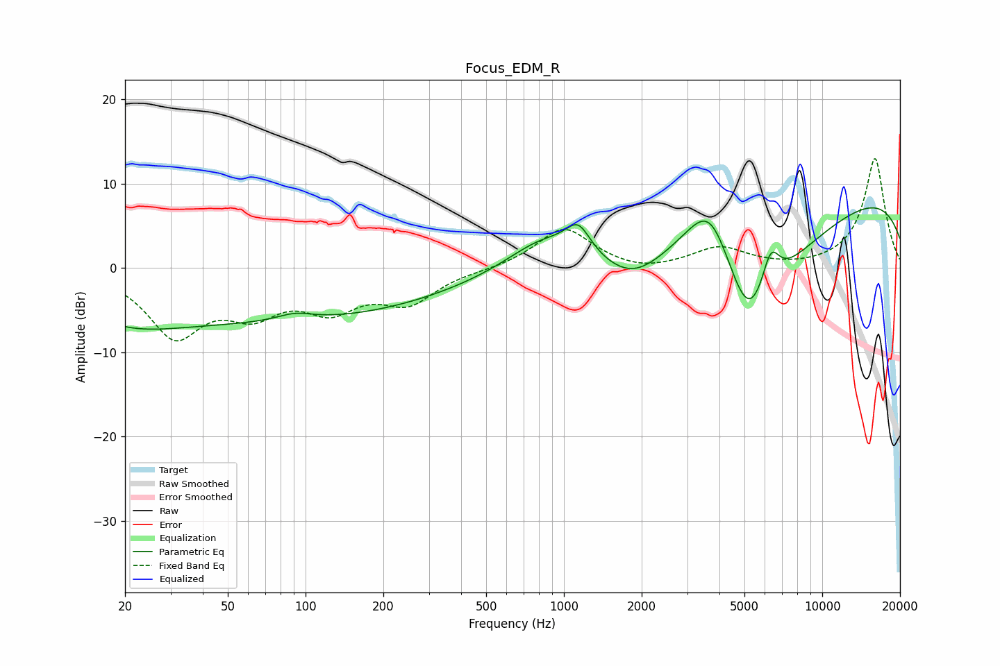

# Focus_EDM_R
See [usage instructions](https://github.com/jaakkopasanen/AutoEq#usage) for more options and info.

### Parametric EQs
Apply preamp of -7.2 dB when using parametric equalizer.

|   # | Type    |   Fc (Hz) |    Q |   Gain (dB) |
|-----|---------|-----------|------|-------------|
|   1 | Peaking |        20 | 0.75 |        -2.4 |
|   2 | Peaking |        69 | 0.18 |        -6.2 |
|   3 | Peaking |        91 | 2.03 |         0.9 |
|   4 | Peaking |       834 | 0.99 |         3.8 |
|   5 | Peaking |      1137 | 2.95 |         3.4 |
|   6 | Peaking |      1844 | 1.18 |        -3.1 |
|   7 | Peaking |      3690 | 1.23 |        11.3 |
|   8 | Peaking |      5178 | 0.79 |       -20   |
|   9 | Peaking |      6312 | 3.82 |         4.9 |
|  10 | Peaking |     10000 | 0.18 |        10.3 |

### Fixed Band EQs
When using fixed band (also called graphic) equalizer, apply preamp of **-13.1 dB** (if available) and set gains manually with these parameters.

|   # | Type    |   Fc (Hz) |    Q |   Gain (dB) |
|-----|---------|-----------|------|-------------|
|   1 | Peaking |        31 | 1.41 |        -7.7 |
|   2 | Peaking |        62 | 1.41 |        -4.3 |
|   3 | Peaking |       125 | 1.41 |        -4.2 |
|   4 | Peaking |       250 | 1.41 |        -3.8 |
|   5 | Peaking |       500 | 1.41 |        -0.2 |
|   6 | Peaking |      1000 | 1.41 |         4.8 |
|   7 | Peaking |      2000 | 1.41 |        -0.7 |
|   8 | Peaking |      4000 | 1.41 |         2.3 |
|   9 | Peaking |      8000 | 1.41 |        -0.1 |
|  10 | Peaking |     16000 | 1.41 |        13   |

### Graphs

