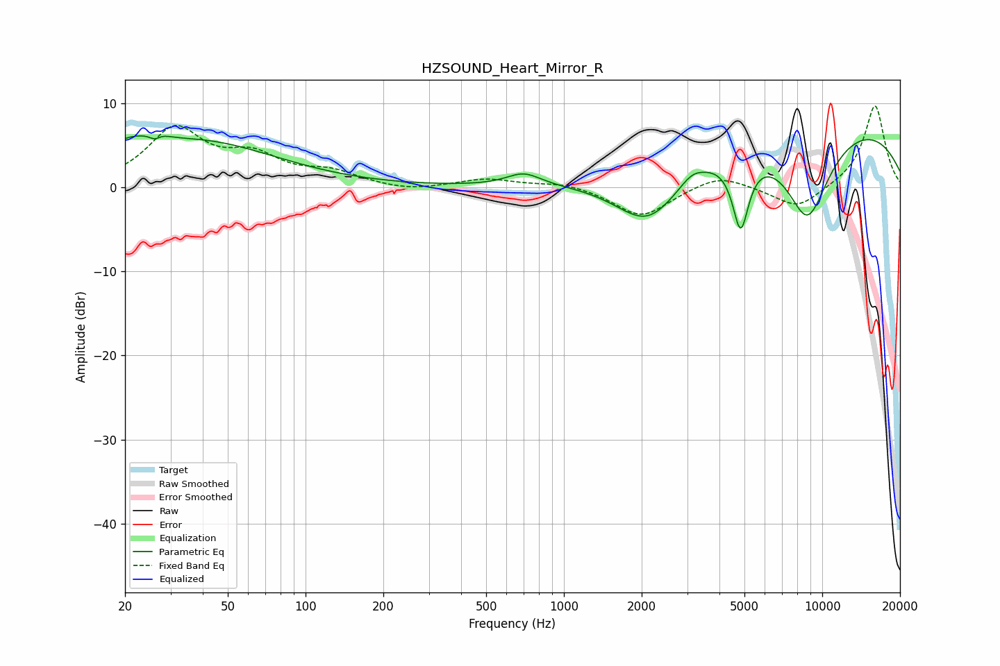

# HZSOUND_Heart_Mirror_R
See [usage instructions](https://github.com/jaakkopasanen/AutoEq#usage) for more options and info.

### Parametric EQs
Apply preamp of -6.2 dB when using parametric equalizer.

|   # | Type    |   Fc (Hz) |    Q |   Gain (dB) |
|-----|---------|-----------|------|-------------|
|   1 | Peaking |        20 | 1.63 |         2   |
|   2 | Peaking |        26 | 5.66 |        -1.8 |
|   3 | Peaking |        26 | 4.17 |         1.8 |
|   4 | Peaking |        38 | 0.46 |         5.3 |
|   5 | Peaking |       698 | 2.13 |         1.5 |
|   6 | Peaking |      2125 | 1.03 |        -7.5 |
|   7 | Peaking |      3128 | 3.25 |         1   |
|   8 | Peaking |      4833 | 4.32 |        -8.7 |
|   9 | Peaking |      8765 | 1.35 |       -11.5 |
|  10 | Peaking |      8879 | 0.21 |         8.8 |

### Fixed Band EQs
When using fixed band (also called graphic) equalizer, apply preamp of **-9.8 dB** (if available) and set gains manually with these parameters.

|   # | Type    |   Fc (Hz) |    Q |   Gain (dB) |
|-----|---------|-----------|------|-------------|
|   1 | Peaking |        31 | 1.41 |         6.7 |
|   2 | Peaking |        62 | 1.41 |         3.1 |
|   3 | Peaking |       125 | 1.41 |         1.6 |
|   4 | Peaking |       250 | 1.41 |        -0.5 |
|   5 | Peaking |       500 | 1.41 |         1   |
|   6 | Peaking |      1000 | 1.41 |         0.6 |
|   7 | Peaking |      2000 | 1.41 |        -3.6 |
|   8 | Peaking |      4000 | 1.41 |         1.7 |
|   9 | Peaking |      8000 | 1.41 |        -2.7 |
|  10 | Peaking |     16000 | 1.41 |         9.9 |

### Graphs

