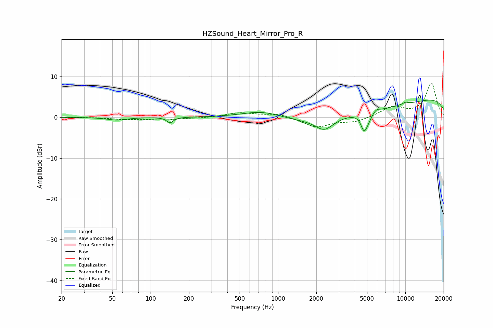

# HZSound_Heart_Mirror_Pro_R
See [usage instructions](https://github.com/jaakkopasanen/AutoEq#usage) for more options and info.

### Parametric EQs
Apply preamp of -4.3 dB when using parametric equalizer.

|   # | Type    |   Fc (Hz) |    Q |   Gain (dB) |
|-----|---------|-----------|------|-------------|
|   1 | Peaking |        54 | 1.89 |        -0.7 |
|   2 | Peaking |       142 | 5.82 |        -1.4 |
|   3 | Peaking |       764 | 0.81 |         2.4 |
|   4 | Peaking |      2311 | 2.03 |        -2.9 |
|   5 | Peaking |      3686 | 0.22 |        -3.8 |
|   6 | Peaking |      4734 | 5.71 |        -3.8 |
|   7 | Peaking |      5093 | 5.17 |        -1.4 |
|   8 | Peaking |      5946 | 5.92 |         0.6 |
|   9 | Peaking |     10000 | 0.18 |         6   |
|  10 | Peaking |     10000 | 5.46 |         0.5 |

### Fixed Band EQs
When using fixed band (also called graphic) equalizer, apply preamp of **-8.5 dB** (if available) and set gains manually with these parameters.

|   # | Type    |   Fc (Hz) |    Q |   Gain (dB) |
|-----|---------|-----------|------|-------------|
|   1 | Peaking |        31 | 1.41 |         0   |
|   2 | Peaking |        62 | 1.41 |        -0.5 |
|   3 | Peaking |       125 | 1.41 |        -0.6 |
|   4 | Peaking |       250 | 1.41 |        -0.2 |
|   5 | Peaking |       500 | 1.41 |         1.1 |
|   6 | Peaking |      1000 | 1.41 |         0.9 |
|   7 | Peaking |      2000 | 1.41 |        -2.4 |
|   8 | Peaking |      4000 | 1.41 |        -1.1 |
|   9 | Peaking |      8000 | 1.41 |         2.5 |
|  10 | Peaking |     16000 | 1.41 |         8.3 |

### Graphs

