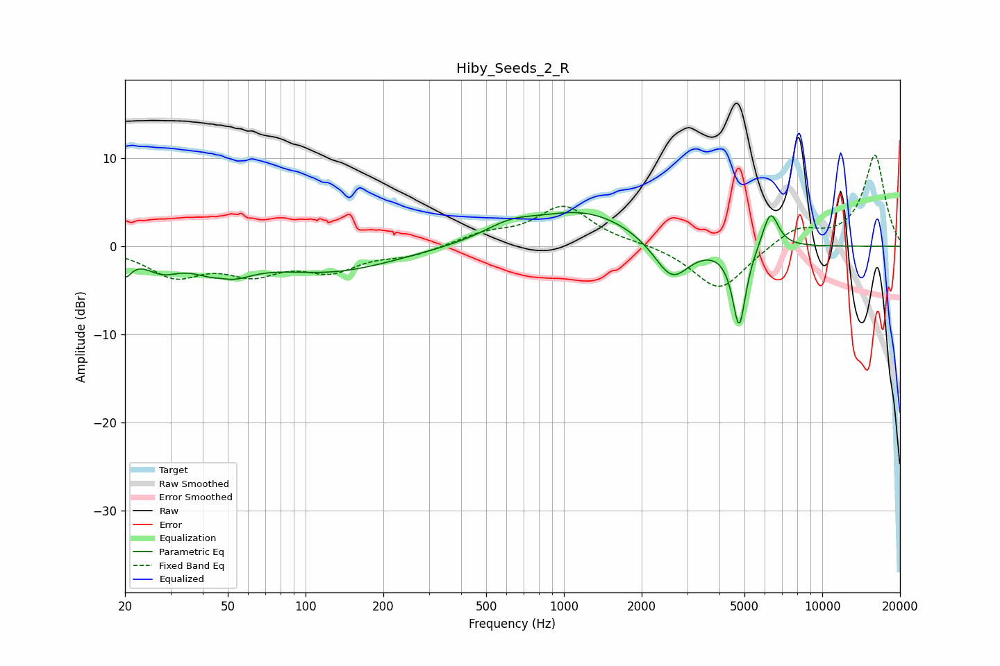

# Hiby_Seeds_2_R
See [usage instructions](https://github.com/jaakkopasanen/AutoEq#usage) for more options and info.

### Parametric EQs
Apply preamp of -3.9 dB when using parametric equalizer.

|   # | Type    |   Fc (Hz) |    Q |   Gain (dB) |
|-----|---------|-----------|------|-------------|
|   1 | Peaking |        20 | 5.61 |        -2.3 |
|   2 | Peaking |        28 | 2.05 |        -2   |
|   3 | Peaking |        47 | 2.76 |         1.2 |
|   4 | Peaking |        48 | 1.65 |        -3.5 |
|   5 | Peaking |       126 | 0.57 |        -2.8 |
|   6 | Peaking |       617 | 1.38 |         1.5 |
|   7 | Peaking |      1208 | 0.69 |         3.9 |
|   8 | Peaking |      2617 | 2.01 |        -4.7 |
|   9 | Peaking |      4770 | 5.3  |        -9.3 |
|  10 | Peaking |      6301 | 4.33 |         4.3 |

### Fixed Band EQs
When using fixed band (also called graphic) equalizer, apply preamp of **-10.4 dB** (if available) and set gains manually with these parameters.

|   # | Type    |   Fc (Hz) |    Q |   Gain (dB) |
|-----|---------|-----------|------|-------------|
|   1 | Peaking |        31 | 1.41 |        -3.1 |
|   2 | Peaking |        62 | 1.41 |        -2.6 |
|   3 | Peaking |       125 | 1.41 |        -2.5 |
|   4 | Peaking |       250 | 1.41 |        -1   |
|   5 | Peaking |       500 | 1.41 |         1.2 |
|   6 | Peaking |      1000 | 1.41 |         4.5 |
|   7 | Peaking |      2000 | 1.41 |         0.3 |
|   8 | Peaking |      4000 | 1.41 |        -5.2 |
|   9 | Peaking |      8000 | 1.41 |         2.1 |
|  10 | Peaking |     16000 | 1.41 |        10.3 |

### Graphs

