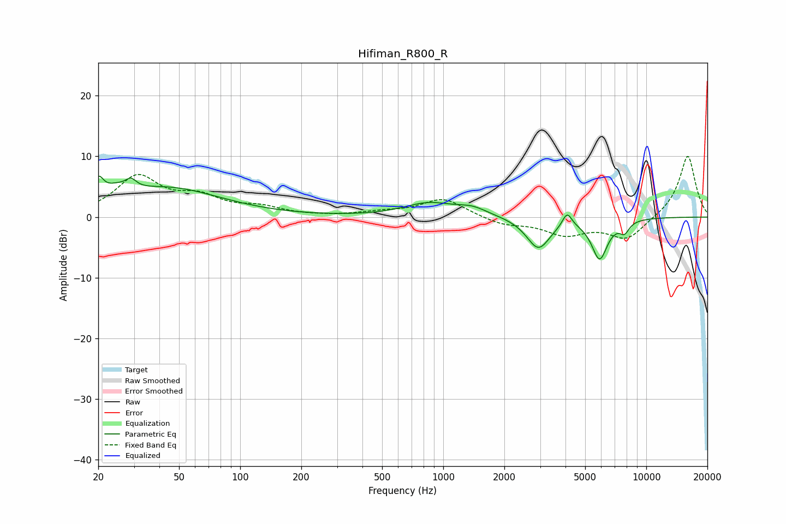

# Hifiman_R800_R
See [usage instructions](https://github.com/jaakkopasanen/AutoEq#usage) for more options and info.

### Parametric EQs
Apply preamp of -6.8 dB when using parametric equalizer.

|   # | Type    |   Fc (Hz) |    Q |   Gain (dB) |
|-----|---------|-----------|------|-------------|
|   1 | Peaking |        20 | 5.74 |         3.3 |
|   2 | Peaking |        24 | 2.39 |         1.5 |
|   3 | Peaking |        29 | 5.54 |         1.4 |
|   4 | Peaking |        44 | 0.54 |         4.7 |
|   5 | Peaking |       848 | 1.15 |         2.2 |
|   6 | Peaking |      1389 | 1.86 |         1.2 |
|   7 | Peaking |      2942 | 2.41 |        -5.2 |
|   8 | Peaking |      4076 | 6    |         2.4 |
|   9 | Peaking |      5890 | 3.48 |        -6.6 |
|  10 | Peaking |      7810 | 5.59 |        -1.7 |

### Fixed Band EQs
When using fixed band (also called graphic) equalizer, apply preamp of **-10.1 dB** (if available) and set gains manually with these parameters.

|   # | Type    |   Fc (Hz) |    Q |   Gain (dB) |
|-----|---------|-----------|------|-------------|
|   1 | Peaking |        31 | 1.41 |         6.4 |
|   2 | Peaking |        62 | 1.41 |         2.8 |
|   3 | Peaking |       125 | 1.41 |         1.3 |
|   4 | Peaking |       250 | 1.41 |         0   |
|   5 | Peaking |       500 | 1.41 |         0.6 |
|   6 | Peaking |      1000 | 1.41 |         3   |
|   7 | Peaking |      2000 | 1.41 |        -1.2 |
|   8 | Peaking |      4000 | 1.41 |        -2.7 |
|   9 | Peaking |      8000 | 1.41 |        -3.7 |
|  10 | Peaking |     16000 | 1.41 |        10.3 |

### Graphs

