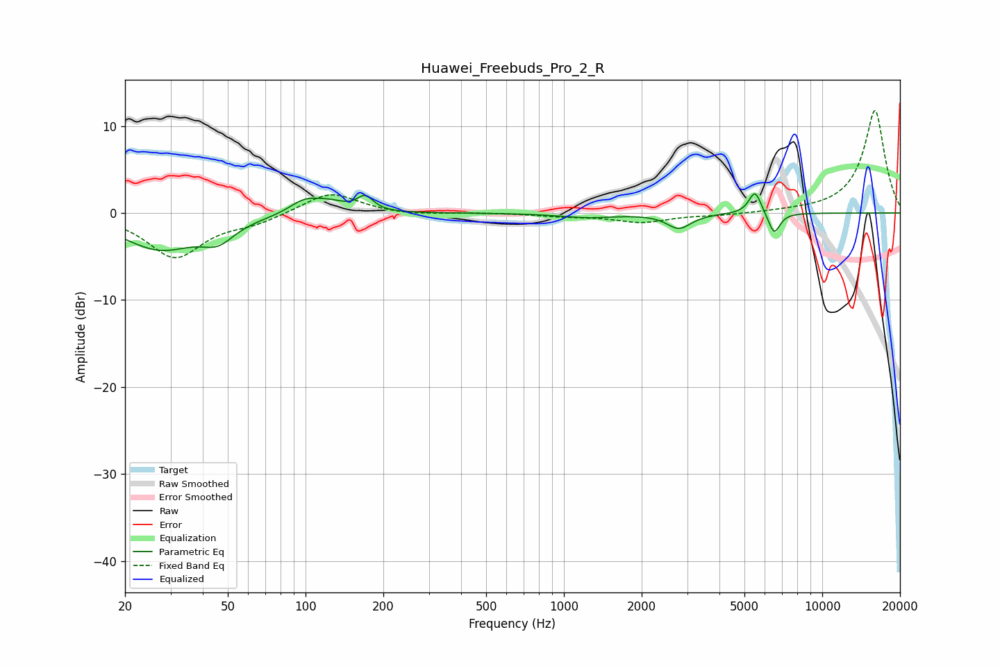

# Huawei_Freebuds_Pro_2_R
See [usage instructions](https://github.com/jaakkopasanen/AutoEq#usage) for more options and info.

### Parametric EQs
Apply preamp of -2.3 dB when using parametric equalizer.

|   # | Type    |   Fc (Hz) |    Q |   Gain (dB) |
|-----|---------|-----------|------|-------------|
|   1 | Peaking |        27 | 0.97 |        -4   |
|   2 | Peaking |        46 | 2.28 |        -2   |
|   3 | Peaking |        98 | 3.53 |        -0.7 |
|   4 | Peaking |        98 | 2.77 |         2.2 |
|   5 | Peaking |       124 | 2.24 |         1.1 |
|   6 | Peaking |       170 | 4.52 |         1.7 |
|   7 | Peaking |      1234 | 1.28 |        -0.5 |
|   8 | Peaking |      2790 | 3.04 |        -1.7 |
|   9 | Peaking |      5497 | 5.79 |         2.7 |
|  10 | Peaking |      6512 | 6    |        -2.5 |

### Fixed Band EQs
When using fixed band (also called graphic) equalizer, apply preamp of **-11.9 dB** (if available) and set gains manually with these parameters.

|   # | Type    |   Fc (Hz) |    Q |   Gain (dB) |
|-----|---------|-----------|------|-------------|
|   1 | Peaking |        31 | 1.41 |        -5   |
|   2 | Peaking |        62 | 1.41 |        -1   |
|   3 | Peaking |       125 | 1.41 |         2.5 |
|   4 | Peaking |       250 | 1.41 |        -0.3 |
|   5 | Peaking |       500 | 1.41 |         0   |
|   6 | Peaking |      1000 | 1.41 |        -0.3 |
|   7 | Peaking |      2000 | 1.41 |        -1   |
|   8 | Peaking |      4000 | 1.41 |        -0.2 |
|   9 | Peaking |      8000 | 1.41 |         0.1 |
|  10 | Peaking |     16000 | 1.41 |        11.8 |

### Graphs

