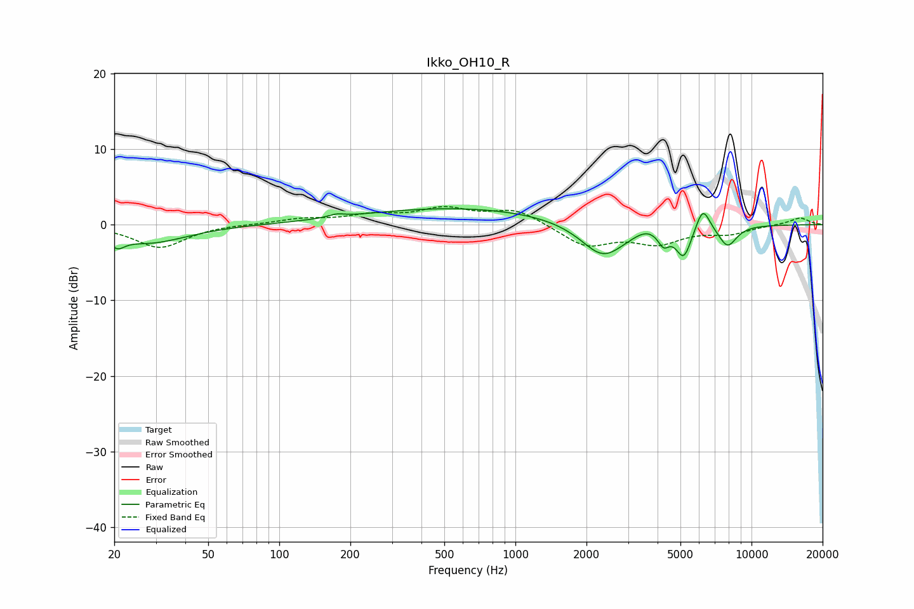

# Ikko_OH10_R
See [usage instructions](https://github.com/jaakkopasanen/AutoEq#usage) for more options and info.

### Parametric EQs
Apply preamp of -2.2 dB when using parametric equalizer.

|   # | Type    |   Fc (Hz) |    Q |   Gain (dB) |
|-----|---------|-----------|------|-------------|
|   1 | Peaking |        21 | 4.71 |        -1.4 |
|   2 | Peaking |        28 | 0.88 |        -2.4 |
|   3 | Peaking |       175 | 4.28 |         0.4 |
|   4 | Peaking |       585 | 0.33 |         2.2 |
|   5 | Peaking |      2352 | 1.49 |        -4.7 |
|   6 | Peaking |      3577 | 2.89 |         0.7 |
|   7 | Peaking |      4241 | 5.99 |        -1.9 |
|   8 | Peaking |      5163 | 4.25 |        -4   |
|   9 | Peaking |      6222 | 4.61 |         3.2 |
|  10 | Peaking |      7914 | 3.38 |        -2.8 |

### Fixed Band EQs
When using fixed band (also called graphic) equalizer, apply preamp of **-2.5 dB** (if available) and set gains manually with these parameters.

|   # | Type    |   Fc (Hz) |    Q |   Gain (dB) |
|-----|---------|-----------|------|-------------|
|   1 | Peaking |        31 | 1.41 |        -3   |
|   2 | Peaking |        62 | 1.41 |         0.1 |
|   3 | Peaking |       125 | 1.41 |         0.7 |
|   4 | Peaking |       250 | 1.41 |         1.1 |
|   5 | Peaking |       500 | 1.41 |         1.9 |
|   6 | Peaking |      1000 | 1.41 |         2   |
|   7 | Peaking |      2000 | 1.41 |        -2.8 |
|   8 | Peaking |      4000 | 1.41 |        -2.2 |
|   9 | Peaking |      8000 | 1.41 |        -1.1 |
|  10 | Peaking |     16000 | 1.41 |         0.9 |

### Graphs

