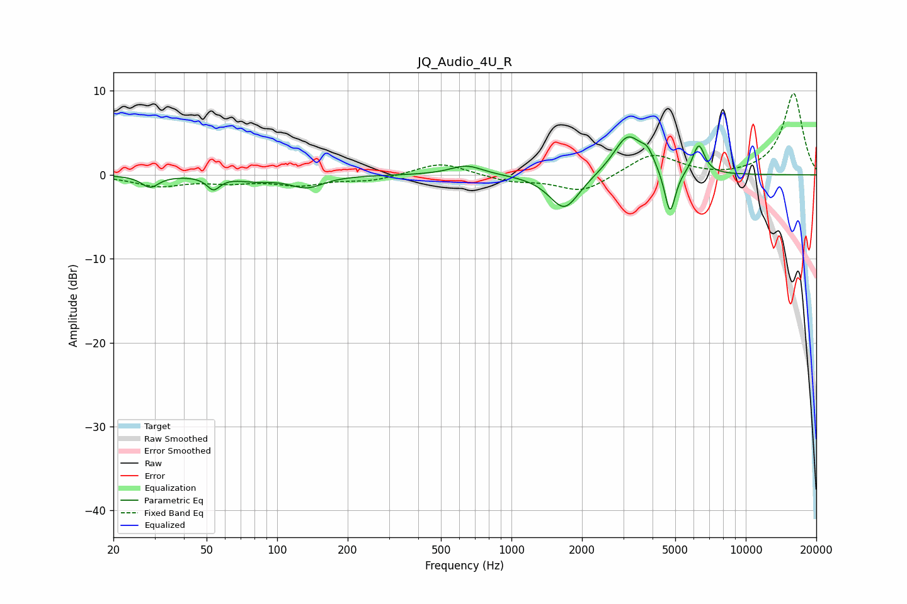

# JQ_Audio_4U_R
See [usage instructions](https://github.com/jaakkopasanen/AutoEq#usage) for more options and info.

### Parametric EQs
Apply preamp of -4.6 dB when using parametric equalizer.

|   # | Type    |   Fc (Hz) |    Q |   Gain (dB) |
|-----|---------|-----------|------|-------------|
|   1 | Peaking |        29 | 3.95 |        -1.4 |
|   2 | Peaking |        53 | 5.21 |        -1.5 |
|   3 | Peaking |        80 | 1.8  |        -0.6 |
|   4 | Peaking |       134 | 2.01 |        -1.4 |
|   5 | Peaking |       643 | 2.03 |         1.2 |
|   6 | Peaking |      1683 | 2.2  |        -4.3 |
|   7 | Peaking |      3138 | 2.29 |         4.8 |
|   8 | Peaking |      3815 | 4.91 |         1.6 |
|   9 | Peaking |      4752 | 5.99 |        -5.5 |
|  10 | Peaking |      6301 | 5.41 |         3.5 |

### Fixed Band EQs
When using fixed band (also called graphic) equalizer, apply preamp of **-9.8 dB** (if available) and set gains manually with these parameters.

|   # | Type    |   Fc (Hz) |    Q |   Gain (dB) |
|-----|---------|-----------|------|-------------|
|   1 | Peaking |        31 | 1.41 |        -1.3 |
|   2 | Peaking |        62 | 1.41 |        -0.7 |
|   3 | Peaking |       125 | 1.41 |        -1.1 |
|   4 | Peaking |       250 | 1.41 |        -0.7 |
|   5 | Peaking |       500 | 1.41 |         1.5 |
|   6 | Peaking |      1000 | 1.41 |        -0.8 |
|   7 | Peaking |      2000 | 1.41 |        -2.1 |
|   8 | Peaking |      4000 | 1.41 |         2.6 |
|   9 | Peaking |      8000 | 1.41 |        -0.3 |
|  10 | Peaking |     16000 | 1.41 |         9.7 |

### Graphs

