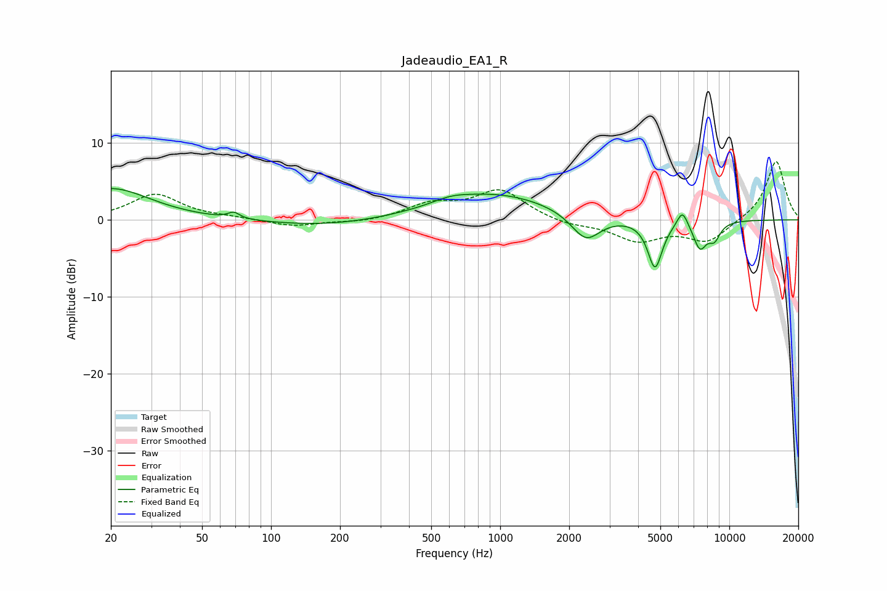

# Jadeaudio_EA1_R
See [usage instructions](https://github.com/jaakkopasanen/AutoEq#usage) for more options and info.

### Parametric EQs
Apply preamp of -4.2 dB when using parametric equalizer.

|   # | Type    |   Fc (Hz) |    Q |   Gain (dB) |
|-----|---------|-----------|------|-------------|
|   1 | Peaking |        20 | 0.83 |         4.1 |
|   2 | Peaking |        69 | 5.77 |         0.8 |
|   3 | Peaking |       173 | 0.55 |        -0.9 |
|   4 | Peaking |       609 | 1.81 |         0.6 |
|   5 | Peaking |       949 | 0.55 |         3.4 |
|   6 | Peaking |      2365 | 2.21 |        -3.6 |
|   7 | Peaking |      4741 | 4.37 |        -6.3 |
|   8 | Peaking |      6240 | 5.86 |         2.2 |
|   9 | Peaking |      7448 | 4.6  |        -3.4 |
|  10 | Peaking |      8598 | 4.84 |        -2.1 |

### Fixed Band EQs
When using fixed band (also called graphic) equalizer, apply preamp of **-7.7 dB** (if available) and set gains manually with these parameters.

|   # | Type    |   Fc (Hz) |    Q |   Gain (dB) |
|-----|---------|-----------|------|-------------|
|   1 | Peaking |        31 | 1.41 |         3.3 |
|   2 | Peaking |        62 | 1.41 |         0.2 |
|   3 | Peaking |       125 | 1.41 |        -0.9 |
|   4 | Peaking |       250 | 1.41 |        -0.4 |
|   5 | Peaking |       500 | 1.41 |         1.9 |
|   6 | Peaking |      1000 | 1.41 |         3.8 |
|   7 | Peaking |      2000 | 1.41 |        -0.7 |
|   8 | Peaking |      4000 | 1.41 |        -2.6 |
|   9 | Peaking |      8000 | 1.41 |        -2.8 |
|  10 | Peaking |     16000 | 1.41 |         7.8 |

### Graphs

