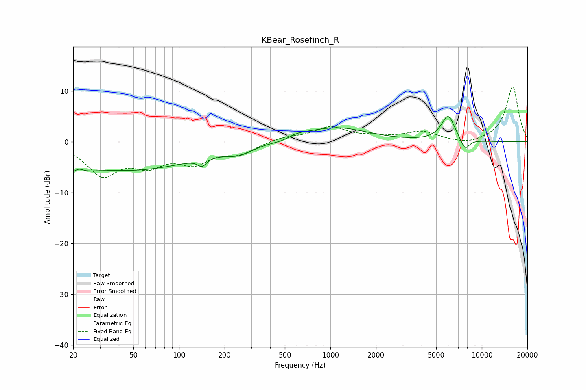

# KBear_Rosefinch_R
See [usage instructions](https://github.com/jaakkopasanen/AutoEq#usage) for more options and info.

### Parametric EQs
Apply preamp of -5.1 dB when using parametric equalizer.

|   # | Type    |   Fc (Hz) |    Q |   Gain (dB) |
|-----|---------|-----------|------|-------------|
|   1 | Peaking |        20 | 2.15 |        -5.8 |
|   2 | Peaking |        21 | 3.17 |         4.1 |
|   3 | Peaking |        49 | 0.33 |        -5.4 |
|   4 | Peaking |       142 | 5.06 |        -1.5 |
|   5 | Peaking |       250 | 1.67 |        -1.5 |
|   6 | Peaking |       494 | 1.97 |        -0.7 |
|   7 | Peaking |       577 | 1.76 |         1   |
|   8 | Peaking |      1091 | 0.7  |         2.8 |
|   9 | Peaking |      5989 | 3.06 |         5.1 |
|  10 | Peaking |      7739 | 4.36 |        -2.3 |

### Fixed Band EQs
When using fixed band (also called graphic) equalizer, apply preamp of **-10.9 dB** (if available) and set gains manually with these parameters.

|   # | Type    |   Fc (Hz) |    Q |   Gain (dB) |
|-----|---------|-----------|------|-------------|
|   1 | Peaking |        31 | 1.41 |        -6.2 |
|   2 | Peaking |        62 | 1.41 |        -3.8 |
|   3 | Peaking |       125 | 1.41 |        -3.6 |
|   4 | Peaking |       250 | 1.41 |        -2.1 |
|   5 | Peaking |       500 | 1.41 |         0.9 |
|   6 | Peaking |      1000 | 1.41 |         2.8 |
|   7 | Peaking |      2000 | 1.41 |         0.7 |
|   8 | Peaking |      4000 | 1.41 |         1.9 |
|   9 | Peaking |      8000 | 1.41 |        -0.7 |
|  10 | Peaking |     16000 | 1.41 |        10.9 |

### Graphs

