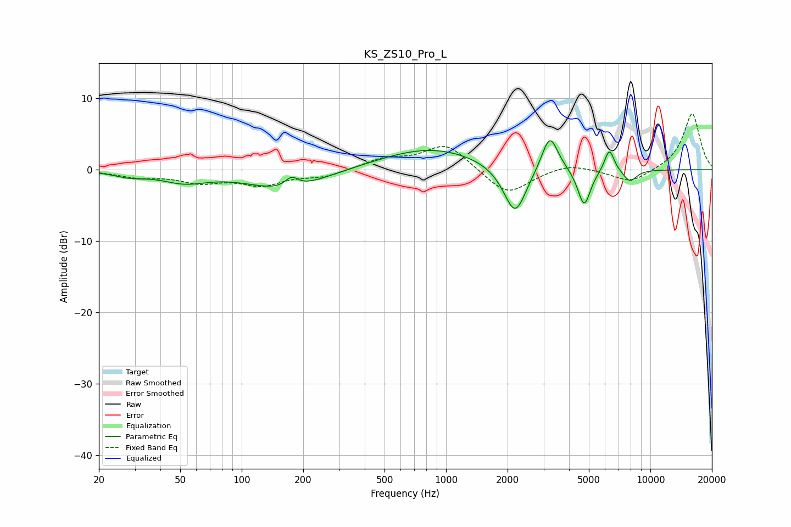

# KS_ZS10_Pro_L
See [usage instructions](https://github.com/jaakkopasanen/AutoEq#usage) for more options and info.

### Parametric EQs
Apply preamp of -4.2 dB when using parametric equalizer.

|   # | Type    |   Fc (Hz) |    Q |   Gain (dB) |
|-----|---------|-----------|------|-------------|
|   1 | Peaking |        28 | 1.84 |        -0.7 |
|   2 | Peaking |        52 | 1.29 |        -1.5 |
|   3 | Peaking |       165 | 0.78 |        -2.9 |
|   4 | Peaking |       176 | 4.38 |         1.5 |
|   5 | Peaking |       844 | 0.57 |         3.1 |
|   6 | Peaking |      2176 | 2.5  |        -7.1 |
|   7 | Peaking |      3219 | 3.5  |         5.3 |
|   8 | Peaking |      4741 | 4.45 |        -5.3 |
|   9 | Peaking |      6297 | 5.79 |         3.2 |
|  10 | Peaking |      7942 | 3.96 |        -1.7 |

### Fixed Band EQs
When using fixed band (also called graphic) equalizer, apply preamp of **-7.9 dB** (if available) and set gains manually with these parameters.

|   # | Type    |   Fc (Hz) |    Q |   Gain (dB) |
|-----|---------|-----------|------|-------------|
|   1 | Peaking |        31 | 1.41 |        -0.9 |
|   2 | Peaking |        62 | 1.41 |        -1.5 |
|   3 | Peaking |       125 | 1.41 |        -1.9 |
|   4 | Peaking |       250 | 1.41 |        -0.9 |
|   5 | Peaking |       500 | 1.41 |         1.4 |
|   6 | Peaking |      1000 | 1.41 |         3.6 |
|   7 | Peaking |      2000 | 1.41 |        -3.7 |
|   8 | Peaking |      4000 | 1.41 |         1   |
|   9 | Peaking |      8000 | 1.41 |        -1.9 |
|  10 | Peaking |     16000 | 1.41 |         8   |

### Graphs

