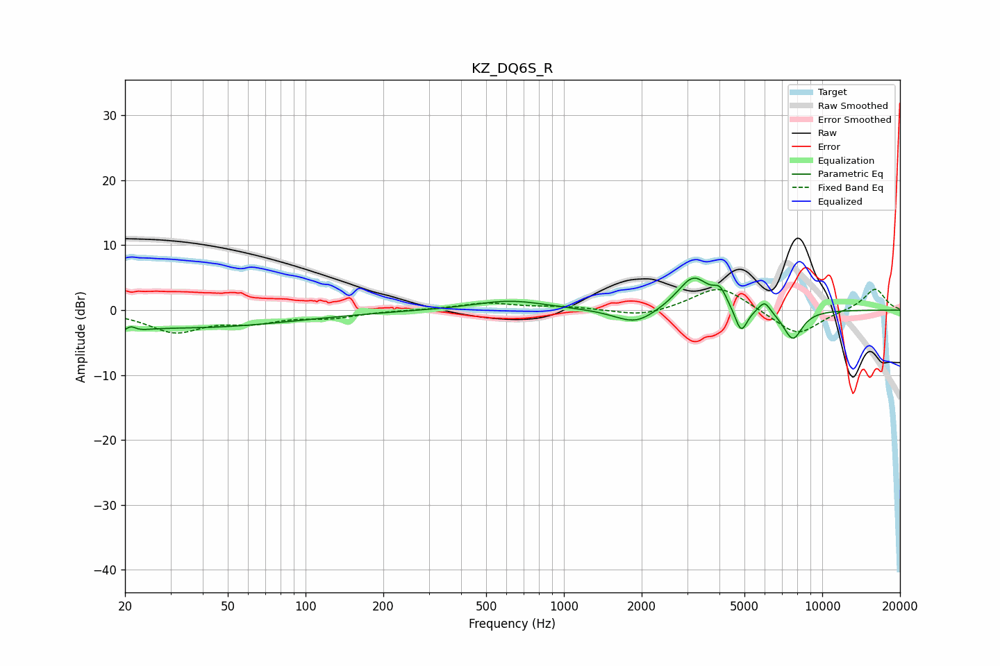

# KZ_DQ6S_R
See [usage instructions](https://github.com/jaakkopasanen/AutoEq#usage) for more options and info.

### Parametric EQs
Apply preamp of -5.0 dB when using parametric equalizer.

|   # | Type    |   Fc (Hz) |    Q |   Gain (dB) |
|-----|---------|-----------|------|-------------|
|   1 | Peaking |        20 | 3.46 |        -2.3 |
|   2 | Peaking |        21 | 5.96 |         2   |
|   3 | Peaking |        35 | 0.34 |        -2.7 |
|   4 | Peaking |       618 | 1.01 |         1.5 |
|   5 | Peaking |      1895 | 1.76 |        -2.4 |
|   6 | Peaking |      3169 | 2.24 |         5.3 |
|   7 | Peaking |      4019 | 5.6  |         2.1 |
|   8 | Peaking |      4855 | 5.8  |        -4   |
|   9 | Peaking |      5982 | 6    |         1.8 |
|  10 | Peaking |      7692 | 3.54 |        -4.6 |

### Fixed Band EQs
When using fixed band (also called graphic) equalizer, apply preamp of **-3.3 dB** (if available) and set gains manually with these parameters.

|   # | Type    |   Fc (Hz) |    Q |   Gain (dB) |
|-----|---------|-----------|------|-------------|
|   1 | Peaking |        31 | 1.41 |        -3.2 |
|   2 | Peaking |        62 | 1.41 |        -1.5 |
|   3 | Peaking |       125 | 1.41 |        -1   |
|   4 | Peaking |       250 | 1.41 |         0   |
|   5 | Peaking |       500 | 1.41 |         1.1 |
|   6 | Peaking |      1000 | 1.41 |         0.5 |
|   7 | Peaking |      2000 | 1.41 |        -1.1 |
|   8 | Peaking |      4000 | 1.41 |         3.9 |
|   9 | Peaking |      8000 | 1.41 |        -4   |
|  10 | Peaking |     16000 | 1.41 |         3.4 |

### Graphs

